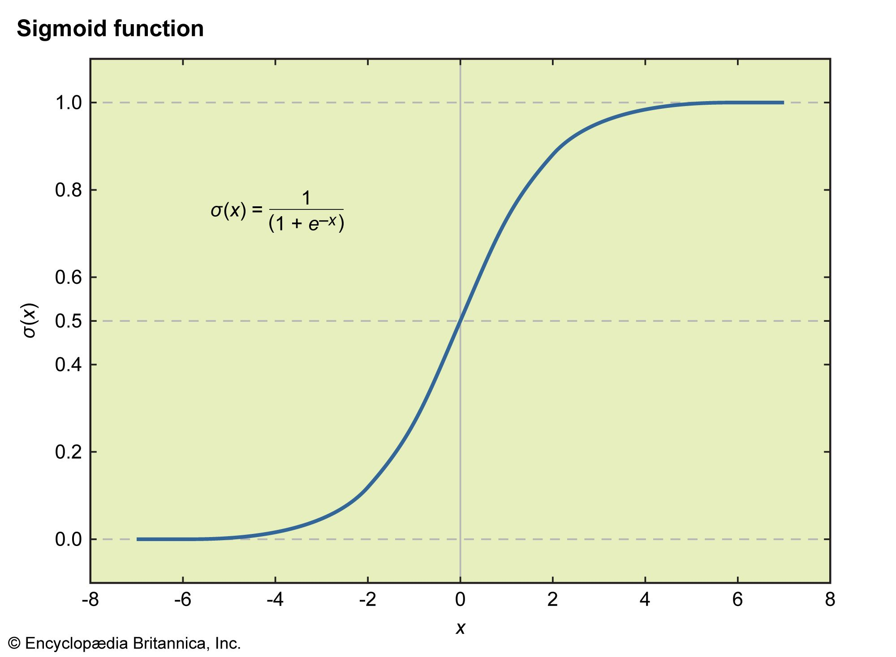

# Logistic Regression

---

## 1. What is Logistic Regression?

Logistic Regression is a **supervised learning algorithm used for classification** (despite the name "regression"). It models the probability that a given input belongs to a particular class.

- Used for **binary classification** (e.g., spam vs. not spam, fraud vs. not fraud, loan default vs. no default) and can be extended to **multiclass classification** (Softmax / Multinomial Logistic Regression).
- It is a **discriminative, linear, parametric** model.
- Output is a **probability between 0 and 1**, converted to a class label using a threshold (commonly 0.5).

---

## 2. Why Not Use Linear Regression for Classification?

If we tried to fit a straight line to binary (0/1) labels:

1. **Unbounded output** — Linear regression can predict values <0 or >1, which are meaningless as probabilities.
2. **Sensitive to outliers** — A single extreme point can shift the decision boundary significantly.
3. **Violates assumptions** — Linear regression assumes homoscedasticity and normally distributed residuals; binary outcomes violate both.
4. **Poor loss function fit** — Squared error loss on 0/1 targets creates a non-convex optimization surface when combined with the sigmoid, making gradient descent unreliable.

Logistic regression solves this by squashing the linear output through a **sigmoid function**, bounding predictions to (0, 1).

---

## 3. The Mathematics

### 3.1 The Sigmoid (Logistic) Function

$$\sigma(z) = \frac{1}{1 + e^{-z}}$$

Where:
$$z = \theta^T x = \theta_0 + \theta_1 x_1 + \theta_2 x_2 + \dots + \theta_n x_n$$

Properties:
- Maps any real number to (0, 1).
- S-shaped curve, symmetric around z = 0 where σ(0) = 0.5.
- Derivative: σ'(z) = σ(z)(1 − σ(z)) — this clean derivative is why sigmoid is convenient for gradient-based optimization.

<p align="center">
    <br>
    <em>Figure 1: Sigmoid Function</em>
</p>

### 3.2 Hypothesis / Prediction

$$h_\theta(x) = \sigma(\theta^T x) = P(y=1 \mid x; \theta)$$

Decision rule:
- If h_θ(x) ≥ 0.5 → predict class 1
- If h_θ(x) < 0.5 → predict class 0

(The 0.5 threshold is adjustable based on business needs — e.g., lower threshold to catch more fraud cases at the cost of more false positives.)

### 3.3 Odds and Log-Odds (Logit)

$$\text{Odds} = \frac{P(y=1)}{P(y=0)} = \frac{P(y=1)}{1-P(y=1)}$$

$$\text{logit}(p) = \ln\left(\frac{p}{1-p}\right) = \theta^T x$$

This is the key insight: **logistic regression models the log-odds of the outcome as a linear function of the inputs.** This is why coefficients are interpreted in terms of odds ratios.

### 3.4 Cost Function — Why Not MSE?

Using Mean Squared Error with sigmoid creates a **non-convex** loss surface (multiple local minima), because sigmoid is nonlinear. Gradient descent could get stuck.

Instead, logistic regression uses **Log Loss / Binary Cross-Entropy**, derived from **Maximum Likelihood Estimation (MLE)**:

$$J(\theta) = -\frac{1}{m}\sum_{i=1}^{m}\left[y^{(i)}\log(h_\theta(x^{(i)})) + (1-y^{(i)})\log(1-h_\theta(x^{(i)}))\right]$$

Intuition:
- If y = 1 and model predicts h ≈ 1 → loss ≈ 0 (good)
- If y = 1 and model predicts h ≈ 0 → loss → ∞ (heavily penalized)
- This asymmetric, exponential penalty is what makes the loss surface **convex**, guaranteeing a global minimum.

### 3.5 Maximum Likelihood Derivation

Since y is Bernoulli distributed:
$$P(y \mid x; \theta) = h_\theta(x)^y (1-h_\theta(x))^{1-y}$$

Likelihood across m samples:
$$L(\theta) = \prod_{i=1}^{m} h_\theta(x^{(i)})^{y^{(i)}} (1-h_\theta(x^{(i)}))^{1-y^{(i)}}$$

Taking the log (log-likelihood) and negating it gives the cross-entropy cost function above. **Minimizing cross-entropy loss = Maximizing likelihood.**

### 3.6 Gradient Descent Update

The gradient of the cost function w.r.t. θ_j turns out to be elegantly simple (same form as linear regression!):

$$\frac{\partial J(\theta)}{\partial \theta_j} = \frac{1}{m}\sum_{i=1}^{m}(h_\theta(x^{(i)}) - y^{(i)})x_j^{(i)}$$

Update rule:
$$\theta_j := \theta_j - \alpha \frac{\partial J(\theta)}{\partial \theta_j}$$

Where α is the learning rate. This is solved via:
- **Batch Gradient Descent**
- **Stochastic Gradient Descent (SGD)**
- **Newton's Method / IRLS (Iteratively Reweighted Least Squares)** — used internally by statsmodels/sklearn's `lbfgs`, `newton-cg` solvers for faster convergence.

---

## 4. Assumptions of Logistic Regression

1. **Linearity in log-odds** — the logit of the outcome is a linear combination of predictors (not the outcome itself).
2. **Independence of observations** — no repeated measures or clustering (violated in time series/panel data unless addressed).
3. **Little or no multicollinearity** among independent variables (check VIF).
4. **Large sample size** — MLE estimates are asymptotically stable; small samples give unstable coefficients.
5. **No strong outliers** in the continuous predictors (they can disproportionately affect the log-odds).
6. Independent variables need **not** be normally distributed, homoscedastic, or continuous (unlike linear regression) — categorical predictors are fine with encoding.

---

## 5. Regularization in Logistic Regression

Regularization prevents overfitting by penalizing large coefficients.

| Type | Penalty Term | Effect |
|---|---|---|
| **L1 (Lasso)** | λΣ\|θⱼ\| | Drives some coefficients to exactly 0 → feature selection |
| **L2 (Ridge)** | λΣθⱼ² | Shrinks coefficients smoothly, handles multicollinearity |
| **Elastic Net** | Mix of L1 + L2 | Balances sparsity and shrinkage |

In sklearn: `LogisticRegression(penalty='l1'/'l2'/'elasticnet', C=...)` — note `C` is the **inverse** of regularization strength (small C = stronger regularization).

---

## 6. Multiclass Extension

### 6.1 One-vs-Rest (OvR)
Train K binary classifiers, one per class (class k vs. all others). Predict the class with the highest probability. Simple, works reasonably well, but probabilities across classes don't necessarily sum to 1.

### 6.2 Multinomial / Softmax Regression
Generalizes sigmoid to K classes using the **softmax function**:

$$P(y=k \mid x) = \frac{e^{\theta_k^T x}}{\sum_{j=1}^{K} e^{\theta_j^T x}}$$

Loss becomes **categorical cross-entropy**. This is the theoretically cleaner approach and what `multi_class='multinomial'` uses in sklearn.

---

## 7. Model Evaluation Metrics

Since output is probabilistic, evaluation goes beyond accuracy:

| Metric | Formula / Description | When to Use |
|---|---|---|
| **Accuracy** | (TP+TN)/Total | Balanced classes only |
| **Precision** | TP/(TP+FP) | Cost of false positives is high (e.g., spam filter) |
| **Recall (Sensitivity)** | TP/(TP+FN) | Cost of false negatives is high (e.g., disease/fraud detection) |
| **F1-Score** | 2·(P·R)/(P+R) | Balance between precision & recall, imbalanced classes |
| **ROC-AUC** | Area under TPR vs FPR curve | Overall ranking quality across thresholds |
| **Precision-Recall AUC** | Area under P-R curve | Better than ROC-AUC for highly imbalanced data |
| **Log Loss** | Cross-entropy on predicted probabilities | Penalizes confident wrong predictions heavily |
| **Confusion Matrix** | TP/FP/TN/FN breakdown | Foundational diagnostic tool |

**Handling class imbalance:** class weighting (`class_weight='balanced'`), resampling (SMOTE, undersampling), threshold tuning, or using PR-AUC instead of ROC-AUC.

---

## 8. Feature Engineering Considerations

- **Scaling**: Not strictly required for correctness (unlike KNN/SVM), but speeds up gradient descent convergence and is required if regularization is applied (so penalty is applied fairly across features).
- **Encoding categorical variables**: One-hot encoding (careful of dummy variable trap — drop one category).
- **Interaction terms**: Since the model is linear in log-odds, non-linear relationships or interactions must be manually engineered (e.g., x1*x2, polynomial terms) or use splines.
- **Handling multicollinearity**: Check VIF (Variance Inflation Factor); drop or combine correlated features.

---

## 9. Advantages and Disadvantages

### Advantages
- Simple, fast to train, computationally cheap even on large datasets.
- Highly **interpretable** — coefficients translate directly to odds ratios.
- Outputs well-calibrated probabilities (with proper regularization/calibration).
- Performs well when classes are (approximately) linearly separable in log-odds space.
- Naturally extends to multiclass and is a strong, robust baseline.
- Less prone to overfitting on high-dimensional sparse data compared to complex models (especially with L1 regularization).

### Disadvantages
- Assumes a **linear decision boundary** in log-odds — poor fit for complex non-linear relationships unless features are engineered.
- Sensitive to **outliers** and multicollinearity.
- Requires a reasonably **large sample size** for stable MLE estimates.
- Doesn't handle missing values natively.
- Can underperform tree-based/ensemble methods on complex tabular data with strong interactions.

---

## 10. Logistic Regression vs. Other Algorithms

| Aspect | Logistic Regression | Decision Tree | SVM | Naive Bayes |
|---|---|---|---|---|
| Decision boundary | Linear (log-odds) | Non-linear, axis-aligned splits | Linear/non-linear (kernel) | Linear (with independence assumption) |
| Interpretability | High | High | Low (esp. with kernels) | Medium |
| Output | Probabilistic | Can be, less calibrated | Not naturally probabilistic | Probabilistic |
| Handles non-linearity | No (needs engineered features) | Yes, natively | Yes, via kernel trick | No |
| Sensitive to feature scaling | Somewhat (for regularization/convergence) | No | Yes | No |
| Assumption on features | Linear log-odds relationship | None | None | Conditional independence |

---

## 11. Coefficient Interpretation (Odds Ratios)

For a unit increase in x_j, holding other variables constant, the **odds** of the outcome multiply by e^(θⱼ):

- θⱼ > 0 → increases odds of y=1
- θⱼ < 0 → decreases odds of y=1
- e^(θⱼ) = 1.5 → a one-unit increase in x_j is associated with a **50% increase** in odds of the positive outcome.

This interpretability is a major reason logistic regression remains popular in **regulated industries like banking and insurance** (credit scoring, fraud models) — regulators and auditors can trace exactly how each feature affects risk, unlike black-box models.

---

## 12. Practical Implementation Notes (Python / sklearn)

```python
from sklearn.linear_model import LogisticRegression
from sklearn.preprocessing import StandardScaler
from sklearn.metrics import classification_report, roc_auc_score

# Scaling is recommended especially when using regularization
scaler = StandardScaler()
X_train_scaled = scaler.fit_transform(X_train)
X_test_scaled = scaler.transform(X_test)

model = LogisticRegression(
    penalty='l2',        # 'l1', 'l2', 'elasticnet', or 'none'
    C=1.0,                # inverse regularization strength
    solver='lbfgs',       # 'liblinear' for small data/L1, 'saga' for elasticnet
    class_weight='balanced',  # useful for imbalanced datasets
    max_iter=1000
)
model.fit(X_train_scaled, y_train)

probs = model.predict_proba(X_test_scaled)[:, 1]
preds = model.predict(X_test_scaled)

print(classification_report(y_test, preds))
print("ROC-AUC:", roc_auc_score(y_test, probs))
```

**Solver cheat sheet:**
- `liblinear`: Good for small datasets, supports L1.
- `lbfgs`, `newton-cg`: Good for L2/no penalty, multinomial.
- `saga`: Supports L1, L2, elasticnet; scales to large datasets.

---

## 13. Common Interview Questions & Answers

### Q1. Why is it called "regression" if it's used for classification?
**A:** Because it models a continuous quantity — the **log-odds (logit)** of the outcome — as a linear regression equation. The classification decision is a secondary step obtained by thresholding the resulting probability.

### Q2. Why do we use log loss instead of MSE for logistic regression?
**A:** Combining MSE with the sigmoid function produces a non-convex cost surface with multiple local minima, making gradient descent unreliable. Log loss (derived from Maximum Likelihood Estimation for a Bernoulli-distributed target) is convex for logistic regression, guaranteeing convergence to a global minimum, and it penalizes confident wrong predictions much more heavily — which is the behavior we want from a probabilistic classifier.

### Q3. What is the difference between sigmoid and softmax?
**A:** Sigmoid handles binary classification, squashing a single score to (0,1) representing P(y=1). Softmax generalizes this to K classes, producing a probability distribution across all classes that sums to 1, by exponentiating and normalizing scores for each class. Sigmoid is actually a special case of softmax for K=2.

### Q4. How do you handle multicollinearity in logistic regression?
**A:** Check the Variance Inflation Factor (VIF) for each predictor. VIF > 5–10 indicates problematic multicollinearity. Solutions: drop one of the correlated features, combine them (e.g., via PCA), or apply L2 regularization, which stabilizes coefficient estimates under collinearity (though it doesn't eliminate the issue, it reduces variance in the estimates).

### Q5. Is feature scaling necessary for logistic regression?
**A:** Not mathematically required for correctness of the maximum likelihood solution, but practically important: (1) it speeds up gradient descent convergence significantly, and (2) it's essential when using regularization, since the penalty term treats all coefficients equally — unscaled features would be penalized unfairly relative to their natural scale.

### Q6. How do you choose the classification threshold, and when would you change it from 0.5?
**A:** The default 0.5 threshold assumes equal cost for false positives and false negatives, which is rarely true in practice. For imbalanced or asymmetric-cost problems (e.g., fraud detection, disease diagnosis), the threshold should be tuned by examining the Precision-Recall curve or ROC curve to find the point that best matches business costs — e.g., lowering the threshold to increase recall (catch more true positives) at the expense of precision.

### Q7. How does L1 regularization differ from L2 in logistic regression, and when would you choose one?
**A:** L1 (Lasso) adds an absolute value penalty and can shrink coefficients exactly to zero, effectively performing feature selection — useful with many features and suspected sparsity. L2 (Ridge) adds a squared penalty, shrinking coefficients smoothly toward zero without eliminating them, and handles multicollinearity better. Elastic Net combines both when you want some sparsity plus stability.

### Q8. What are the assumptions of logistic regression, and what happens if they're violated?
**A:** Key assumptions: linearity between predictors and log-odds, independence of observations, no severe multicollinearity, and sufficiently large sample size for stable MLE. If linearity in log-odds is violated, the model underfits nonlinear relationships (fix: add interaction/polynomial terms or use a non-linear model). If observations aren't independent (e.g., repeated measures), standard errors are underestimated, inflating false confidence in coefficients.

### Q9. Can logistic regression handle non-linear decision boundaries?
**A:** Not directly, since it produces a decision boundary that's linear in the log-odds space. However, non-linearity can be captured by manually engineering features (polynomial terms, interaction terms, binning continuous variables) or by using basis expansions before fitting. This is a key trade-off versus tree-based models, which capture non-linearity natively.

### Q10. What's the difference between odds and probability?
**A:** Probability is P(event) ∈ [0,1]. Odds = P(event)/(1−P(event)), ranging from 0 to ∞. Logistic regression coefficients directly relate to changes in **log-odds**, not probability — a common interview trap is assuming coefficients directly represent probability change, which they don't due to the non-linear sigmoid transformation.

### Q11. How would you evaluate a logistic regression model on a highly imbalanced dataset?
**A:** Avoid plain accuracy since it's misleading (a 95%-majority-class dataset gives 95% accuracy trivially by always predicting the majority class). Prefer Precision, Recall, F1-score, and especially Precision-Recall AUC over ROC-AUC (ROC-AUC can look deceptively good under imbalance). Consider `class_weight='balanced'`, resampling techniques (SMOTE, undersampling), and threshold tuning based on business cost.

### Q12. What is the difference between generative and discriminative models, and where does logistic regression fit?
**A:** Generative models (e.g., Naive Bayes, LDA) model the joint distribution P(x, y) and derive P(y|x) via Bayes' theorem — they can generate synthetic data. Discriminative models like logistic regression directly model P(y|x) without modeling how the features themselves are distributed. Discriminative models often perform better with more data and fewer distributional assumptions, but generative models can work better with small samples if their assumptions hold.

### Q13. Why is the sigmoid function used specifically (rather than any other S-shaped function)?
**A:** The sigmoid arises naturally as the inverse of the logit link function when we assume the target follows a Bernoulli distribution and model the log-odds linearly (this is a special case of a Generalized Linear Model with a logit link). It also has a mathematically convenient derivative — σ'(z) = σ(z)(1−σ(z)) — which simplifies the gradient computation during optimization.

### Q14. How do you detect and handle overfitting in logistic regression?
**A:** Signs: large gap between training and validation performance, unusually large coefficient magnitudes. Fixes: apply L1/L2/Elastic Net regularization, reduce feature count (especially correlated or noisy features), gather more training data, and use cross-validation to tune the regularization strength (C in sklearn).

### Q15. What's the relationship between logistic regression and a single-layer neural network?
**A:** Logistic regression is mathematically equivalent to a neural network with no hidden layers, a single output neuron, and a sigmoid activation function, trained with cross-entropy loss. It can be viewed as the simplest possible neural network — this framing is often used to bridge classical ML and deep learning in interviews.

### Q16. How would you explain logistic regression to a non-technical stakeholder?
**A:** "It's a model that estimates the probability of an event happening — like whether a customer will churn or a transaction is fraudulent — based on weighted combinations of input factors. Each factor gets a weight showing how much it increases or decreases the chance of the event, and we can explain exactly why the model made a given prediction, which makes it easy to trust and audit."

### Q17. Derive the gradient of the log-loss cost function w.r.t. θ.
**A:** Starting from J(θ) = -(1/m)Σ[y·log(h) + (1-y)·log(1-h)] where h = σ(θᵀx):
- Using the chain rule and the fact that σ'(z) = σ(z)(1-σ(z)), the derivative simplifies beautifully because the σ'(z) terms cancel with denominator terms from the log derivatives, leaving:
$$\frac{\partial J}{\partial \theta_j} = \frac{1}{m}\sum_{i=1}^m (h_\theta(x^{(i)}) - y^{(i)})x_j^{(i)}$$
- This is structurally identical to linear regression's gradient (predicted − actual, weighted by feature value) — a frequently asked "derive it on the whiteboard" question.

---

## 14. Quick Summary Cheat-Sheet

| Concept | Key Point |
|---|---|
| Model type | Discriminative, linear (in log-odds), parametric |
| Core function | Sigmoid: σ(z) = 1/(1+e⁻ᶻ) |
| Loss function | Binary cross-entropy (log loss), from MLE |
| Optimization | Gradient descent, Newton's method / IRLS |
| Multiclass | One-vs-Rest or Softmax (multinomial) |
| Regularization | L1 (sparsity), L2 (shrinkage), Elastic Net |
| Key assumption | Linear relationship between features and log-odds |
| Best evaluation metrics | ROC-AUC, PR-AUC, F1, Log Loss (not just accuracy) |
| Strength | Interpretability, speed, solid baseline |
| Weakness | Can't capture non-linearity without feature engineering |

---


