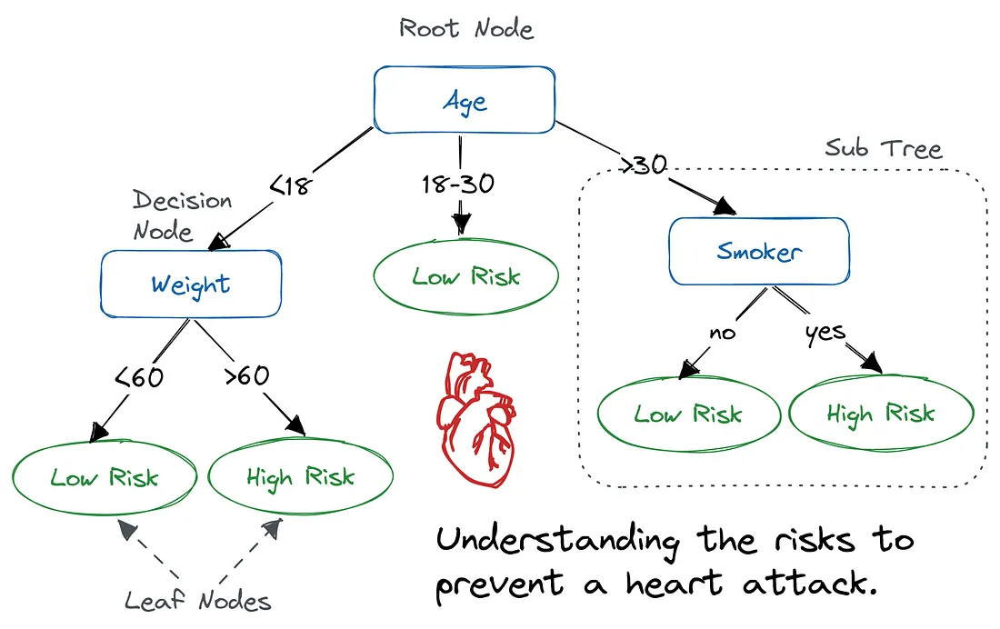

# Decision Trees
---

## 1. Definition and Fundamental Concepts

### 1.1 What is a Decision Tree?

A **Decision Tree** is a supervised learning algorithm used for both **classification** and **regression** tasks. It models decisions as a tree-like structure where:

- **Root Node**: The topmost node representing the entire dataset, which gets split first.
- **Internal (Decision) Nodes**: Represent a test/condition on a feature (e.g., `Age < 30?`).
- **Branches (Edges)**: Represent the outcome of a test, leading to the next node.
- **Leaf Nodes (Terminal Nodes)**: Represent the final output — a class label (classification) or a continuous value (regression).

Think of it as a nested sequence of `if-else` conditions that the model learns automatically from data, rather than being hand-coded by a human.

<p align="center">
    <br>
    <em>Figure 1: Decision tree</em>
</p>

### 1.2 Why Decision Trees?

- **Interpretability**: Arguably the most human-readable ML model — you can trace the exact path of any prediction.
- **No need for feature scaling**: Since splits are based on thresholds, not distances, normalization/standardization is not required.
- **Handles both numerical and categorical data** natively.
- **Non-parametric**: Makes no assumption about the underlying data distribution.
- **Captures non-linear relationships** and feature interactions automatically.

### 1.3 Core Idea

The algorithm recursively partitions the feature space into smaller, more homogeneous regions. At every step, it asks: *"Which feature and which threshold, if used to split the data, will make the resulting subsets as 'pure' (homogeneous) as possible?"*

This is known as **Recursive Binary Splitting** (in CART) or **multi-way splitting** (in ID3 for categorical features).

### 1.4 Key Terminology

| Term | Meaning |
|---|---|
| **Splitting** | Dividing a node into two or more sub-nodes |
| **Pruning** | Removing sub-nodes to reduce overfitting (opposite of splitting) |
| **Parent/Child Node** | A node divided into sub-nodes is a parent; the sub-nodes are children |
| **Depth of tree** | Length of the longest path from root to a leaf |
| **Impurity** | A measure of how mixed the classes are within a node |

---

## 2. Working Methodology (How a Decision Tree is Built)

Decision trees are built using a **greedy, top-down, recursive partitioning** approach known as **recursive binary splitting** (for CART):

### Step-by-Step Process

1. **Start at the root** with the entire training dataset.
2. **Evaluate every possible split**: For each feature, and for each possible threshold/category, calculate an impurity metric (Gini Index, Entropy, or Variance for regression) for the resulting child nodes.
3. **Choose the best split**: Select the feature + threshold combination that results in the **maximum reduction in impurity** (or maximum Information Gain).
4. **Split the data** into child nodes based on this decision.
5. **Recurse**: Repeat steps 2–4 for each child node.
6. **Stop** when a stopping criterion is met:
   - Node becomes pure (all samples belong to one class)
   - Maximum depth is reached
   - Minimum samples per node/leaf threshold is reached
   - No further information gain is possible
   - Minimum impurity decrease threshold not met

### Important Nuance: Greedy Algorithm

Decision trees use a **greedy algorithm** — at each step, they choose the locally optimal split without considering the impact on future splits. This means a decision tree does **not** guarantee a globally optimal tree. This greediness is a key source of the model's tendency to overfit and its instability (small data changes → different tree).

### Prediction Phase

Once trained, making a prediction is simple and fast:
- Start at the root.
- Traverse the tree by answering the condition at each node using the input's feature values.
- Stop at a leaf node.
- **Classification**: Output the majority class in that leaf (or class probabilities based on class distribution).
- **Regression**: Output the mean (or sometimes median) of the target values in that leaf.

---

## 3. Key Metrics: Splitting Criteria

The entire "intelligence" of a decision tree lies in **how it decides where to split**. This is governed by impurity/purity measures.

### 3.1 Entropy

Entropy measures the amount of **disorder or randomness** in a dataset. Borrowed from information theory (Shannon Entropy).

$$Entropy(S) = -\sum_{i=1}^{c} p_i \log_2(p_i)$$

Where:
- $p_i$ = proportion of samples belonging to class $i$
- $c$ = number of classes

**Properties:**
- Entropy = 0 → node is perfectly pure (all one class)
- Entropy = 1 (max, for binary classification) → node is maximally impure (50-50 split)
- Range: [0, log₂(c)]

**Example**: For a node with 10 samples — 6 "Yes" and 4 "No":
$$Entropy = -(0.6 \log_2 0.6 + 0.4 \log_2 0.4) = -(0.6 \times -0.737 + 0.4 \times -1.32) = 0.971$$

### 3.2 Information Gain (IG)

Information Gain measures the **reduction in entropy** achieved after splitting a dataset on a particular feature. Used primarily in **ID3** and **C4.5**.

$$IG(S, A) = Entropy(S) - \sum_{v \in Values(A)} \frac{|S_v|}{|S|} Entropy(S_v)$$

Where:
- $S$ = the parent dataset/node
- $A$ = the feature being tested
- $S_v$ = subset of $S$ where feature $A$ has value $v$

**Interpretation**: The feature that yields the **highest Information Gain** is chosen for splitting at that node — it "explains" the target variable best.

**Bias Caveat**: IG is biased toward features with many distinct values (e.g., an ID column would trivially give the highest IG since each split would create pure single-sample nodes). This is why **C4.5 uses Gain Ratio** instead — it normalizes IG by the intrinsic information of the split (Split Information), penalizing features with many outcomes.

$$GainRatio(S,A) = \frac{IG(S,A)}{SplitInfo(S,A)}$$

### 3.3 Gini Index (Gini Impurity)

Gini Index measures the probability of **incorrectly classifying** a randomly chosen element if it were randomly labeled according to the distribution of labels in the node. Used primarily in **CART**.

$$Gini(S) = 1 - \sum_{i=1}^{c} p_i^2$$

**Properties:**
- Gini = 0 → pure node
- Gini = 0.5 (max, for binary) → maximum impurity (50-50 split)
- Computationally faster than entropy (no logarithm computation)

**Example**: Same node — 6 "Yes", 4 "No" out of 10:
$$Gini = 1 - (0.6^2 + 0.4^2) = 1 - (0.36 + 0.16) = 0.48$$

For a split, CART computes the **weighted Gini** of children:
$$Gini_{split} = \frac{|S_{left}|}{|S|} Gini(S_{left}) + \frac{|S_{right}|}{|S|} Gini(S_{right})$$

The split that **minimizes** the weighted Gini (i.e., maximizes the Gini decrease) is selected.

### 3.4 Gini vs Entropy — Practical Comparison

| Aspect | Gini Index | Entropy |
|---|---|---|
| Formula | $1 - \sum p_i^2$ | $-\sum p_i \log_2 p_i$ |
| Computation | Faster (no log) | Slower |
| Range (binary) | [0, 0.5] | [0, 1] |
| Sensitivity | Slightly favors larger partitions | Slightly more sensitive to changes in probability |
| Used in | CART | ID3, C4.5 |
| Practical difference | In practice, both usually produce very similar trees; differences are rarely significant | — |

**Interview tip**: They usually lead to similar trees in ~90% of cases. Gini is preferred in `sklearn`'s default `DecisionTreeClassifier` primarily for **computational efficiency**, not because it's theoretically superior.

### 3.5 Variance Reduction (for Regression Trees)

For regression tasks, instead of Gini/Entropy, we use **Variance Reduction** or equivalently minimize **Mean Squared Error (MSE)**:

$$Variance(S) = \frac{1}{n}\sum_{i=1}^{n}(y_i - \bar{y})^2$$

The split that minimizes the weighted variance (or MSE) of the children is chosen. The leaf's prediction is the **mean** of target values in that leaf.

---

## 4. Prominent Algorithms

### 4.1 ID3 (Iterative Dichotomiser 3)

Developed by **Ross Quinlan (1986)**.

**Key characteristics:**
- Uses **Information Gain** (based on Entropy) as the splitting criterion.
- Works **only with categorical features** (continuous features need to be discretized/binned first).
- Produces a **multi-way tree** (a node can split into more than 2 branches — one branch per category value).
- **No support for missing values** natively.
- **No pruning mechanism** — highly prone to overfitting.
- Only supports **classification**, not regression.

**Successor: C4.5** (also by Quinlan) improved on ID3 by:
- Handling continuous attributes (via threshold splits).
- Using **Gain Ratio** instead of raw Information Gain (fixes bias toward multi-valued features).
- Handling missing values.
- Including **post-pruning** (reduced error pruning).

### 4.2 CART (Classification and Regression Trees)

Developed by **Breiman, Friedman, Olshen, Stone (1984)**.

**Key characteristics:**
- Uses **Gini Index** for classification and **Variance/MSE Reduction** for regression.
- Produces **strictly binary trees** (every split is a yes/no, two-way split) — even categorical features are split into two groups.
- Supports both **classification and regression** (hence the name).
- Handles both continuous and categorical variables.
- Includes **cost-complexity pruning** (also called weakest-link pruning) as a built-in mechanism to control overfitting.
- This is the algorithm implemented in **scikit-learn's `DecisionTreeClassifier`/`DecisionTreeRegressor`**.

### 4.3 Quick Comparison Table

| Feature | ID3 | C4.5 | CART |
|---|---|---|---|
| Splitting Criterion | Information Gain | Gain Ratio | Gini Index / Variance |
| Tree Type | Multi-way | Multi-way | Binary only |
| Handles Continuous Data | No (needs discretization) | Yes | Yes |
| Handles Missing Values | No | Yes | Yes (surrogate splits) |
| Pruning | No | Yes (post-pruning) | Yes (cost-complexity pruning) |
| Task | Classification only | Classification only | Classification + Regression |
| sklearn default? | No | No | **Yes** |

---

## 5. Overfitting and Pruning

Decision trees are notorious for **overfitting** — if grown to full depth, a tree can perfectly memorize training data (each leaf = 1 sample), leading to poor generalization.

### 5.1 Pre-Pruning (Early Stopping)

Stopping tree growth **before** it becomes fully grown, using hyperparameters:
- `max_depth`: Maximum depth of the tree.
- `min_samples_split`: Minimum samples required to split an internal node.
- `min_samples_leaf`: Minimum samples required to be at a leaf node.
- `max_leaf_nodes`: Maximum number of leaf nodes.
- `min_impurity_decrease`: Minimum impurity decrease required to make a split.

### 5.2 Post-Pruning (Cost-Complexity Pruning)

Grow the tree fully, then **remove branches** that provide little predictive power, using a **complexity parameter (α, or `ccp_alpha` in sklearn)**:

$$R_\alpha(T) = R(T) + \alpha |T|$$

Where $R(T)$ is the misclassification error/impurity of tree $T$, and $|T|$ is the number of leaf nodes. Higher α → more aggressive pruning → simpler tree. This is generally considered more effective than pre-pruning because it lets the tree see the "full picture" before deciding what to cut.

---

## 6. Simple, Illustrative Code Example

```python
import numpy as np
import pandas as pd
from sklearn.tree import DecisionTreeClassifier, plot_tree, export_text
from sklearn.model_selection import train_test_split
from sklearn.metrics import accuracy_score, classification_report
import matplotlib.pyplot as plt

# --------------------------------------------------
# 1. Sample dataset: "Should I play tennis today?"
# --------------------------------------------------
data = {
    'Outlook':     ['Sunny','Sunny','Overcast','Rain','Rain','Rain','Overcast',
                     'Sunny','Sunny','Rain','Sunny','Overcast','Overcast','Rain'],
    'Temperature': ['Hot','Hot','Hot','Mild','Cool','Cool','Cool',
                     'Mild','Cool','Mild','Mild','Mild','Hot','Mild'],
    'Humidity':    ['High','High','High','High','Normal','Normal','Normal',
                     'High','Normal','Normal','Normal','High','Normal','High'],
    'Wind':        ['Weak','Strong','Weak','Weak','Weak','Strong','Strong',
                     'Weak','Weak','Weak','Strong','Strong','Weak','Strong'],
    'PlayTennis':  ['No','No','Yes','Yes','Yes','No','Yes',
                     'No','Yes','Yes','Yes','Yes','Yes','No']
}
df = pd.DataFrame(data)

# --------------------------------------------------
# 2. Encode categorical variables (CART needs numeric input)
# --------------------------------------------------
df_encoded = pd.get_dummies(df.drop('PlayTennis', axis=1))
X = df_encoded
y = df['PlayTennis'].map({'Yes': 1, 'No': 0})

# --------------------------------------------------
# 3. Train-test split
# --------------------------------------------------
X_train, X_test, y_train, y_test = train_test_split(
    X, y, test_size=0.3, random_state=42
)

# --------------------------------------------------
# 4. Build the Decision Tree (using Gini - CART default)
# --------------------------------------------------
clf = DecisionTreeClassifier(
    criterion='gini',      # try 'entropy' to compare with ID3-style splitting
    max_depth=3,            # pre-pruning to avoid overfitting
    min_samples_split=2,
    random_state=42
)
clf.fit(X_train, y_train)

# --------------------------------------------------
# 5. Evaluate
# --------------------------------------------------
y_pred = clf.predict(X_test)
print("Accuracy:", accuracy_score(y_test, y_pred))
print(classification_report(y_test, y_pred))

# --------------------------------------------------
# 6. Inspect the tree structure (human-readable rules)
# --------------------------------------------------
print(export_text(clf, feature_names=list(X.columns)))

# --------------------------------------------------
# 7. Visualize the tree
# --------------------------------------------------
plt.figure(figsize=(14, 8))
plot_tree(clf, feature_names=X.columns, class_names=['No', 'Yes'],
          filled=True, rounded=True)
plt.show()

# --------------------------------------------------
# 8. Feature Importance
# --------------------------------------------------
importances = pd.Series(clf.feature_importances_, index=X.columns)
print(importances.sort_values(ascending=False))
```

### Manual Gini Calculation Example (for intuition)

```python
def gini_impurity(labels):
    """Compute Gini impurity for a list of class labels."""
    labels = pd.Series(labels)
    proportions = labels.value_counts(normalize=True)
    return 1 - np.sum(proportions ** 2)

def entropy(labels):
    """Compute Shannon entropy for a list of class labels."""
    labels = pd.Series(labels)
    proportions = labels.value_counts(normalize=True)
    return -np.sum(proportions * np.log2(proportions))

# Example: comparing a pure vs impure node
pure_node = ['Yes', 'Yes', 'Yes', 'Yes']
impure_node = ['Yes', 'No', 'Yes', 'No']

print("Pure node   -> Gini:", gini_impurity(pure_node), "| Entropy:", entropy(pure_node))
print("Impure node -> Gini:", gini_impurity(impure_node), "| Entropy:", entropy(impure_node))
```

**Output interpretation**: The pure node gives Gini = 0 and Entropy = 0 (no impurity), while the 50-50 impure node gives Gini = 0.5 and Entropy = 1.0 (maximum impurity for binary classification) — validating the theoretical bounds discussed in Section 3.

---

## 7. Common & Tricky Interview Questions (With Expert Answers)

### Q1. Why does scikit-learn's `DecisionTreeClassifier` only implement CART and not ID3/C4.5?

**Answer**: scikit-learn implements an **optimized version of CART** because CART supports both classification and regression, handles continuous features natively, and produces binary splits which are computationally efficient and easier to optimize. ID3/C4.5 require multi-way splits and native categorical handling, which don't fit well into sklearn's array-based, vectorized numeric architecture. This is why sklearn requires categorical variables to be **one-hot encoded or label encoded** beforehand.

### Q2. Why is a decision tree considered a "greedy" algorithm, and what's the consequence?

**Answer**: At each node, the tree picks the **locally optimal split** (max information gain/min impurity) without looking ahead at how this choice affects future splits down the tree. This means it doesn't guarantee finding the globally optimal tree (finding the truly optimal tree is NP-complete). The consequence is that decision trees are **high variance** models — small changes in training data can lead to a completely different tree structure. This is precisely the motivation behind **ensemble methods like Random Forests and Gradient Boosting**, which average over many trees to reduce this variance.

### Q3. Gini Index vs. Entropy — does the choice actually matter in practice?

**Answer**: Theoretically yes, but practically, the difference is usually marginal. Both are concave functions that peak at 50-50 class distribution and are zero at purity. Gini is computationally cheaper (no log computation), which is why it's the default in sklearn. Entropy is *slightly* more sensitive to changes in class probabilities (due to the log term), so it can occasionally produce marginally more balanced trees, but empirical studies (including Breiman's own analysis) show they agree in the vast majority of splits. **A good answer should acknowledge this is more of a computational/theoretical nuance than a major practical decision.**

### Q4. Why do decision trees not require feature scaling, unlike algorithms like KNN or SVM?

**Answer**: Decision trees make splits based on **threshold comparisons** on a single feature at a time (e.g., `Age > 30`), not on distance metrics or gradients that are sensitive to the scale of different features. Since the split point is chosen based on the rank-order/threshold within a feature, scaling a feature doesn't change *which* split is optimal. This is a distinguishing property versus distance-based or gradient-based algorithms.

### Q5. How does a decision tree handle missing values?

**Answer**: This differs by implementation:
- **CART** (as originally designed) uses **surrogate splits** — it finds alternative features that mimic the primary split's behavior for records where the primary feature is missing.
- **C4.5** distributes the sample probabilistically across branches, weighted by the proportion of non-missing samples in each branch.
- **scikit-learn's implementation** does NOT support missing values natively (as of most versions) — the data must be imputed prior to training. (Interviewees should verify against the latest sklearn version since this has evolved.)

### Q6. Why is Information Gain biased towards features with many unique values, and how is this fixed?

**Answer**: A feature like a unique "Customer ID" would create a separate branch for every single customer, leading to perfectly pure leaves (each with 1 sample) — this yields the theoretical maximum Information Gain, but the resulting model is meaningless and massively overfit (zero generalization). This happens because plain IG doesn't penalize the *number* of resulting partitions. **C4.5 fixes this using Gain Ratio**, which divides IG by the "Split Information" (the entropy of the split itself), penalizing splits that create many small partitions.

### Q7. What is the time complexity of building and predicting with a decision tree?

**Answer**: 
- **Training**: Approximately $O(n \times m \times \log n)$ where $n$ = number of samples and $m$ = number of features (due to needing to sort feature values at each node to find the optimal split threshold).
- **Prediction**: $O(depth)$ per sample, i.e., $O(\log n)$ for a balanced tree — this is why trees are extremely fast at inference time.

### Q8. How do decision trees handle categorical variables with high cardinality?

**Answer**: For CART's binary splits, a categorical feature with $k$ categories theoretically has $2^{k-1} - 1$ possible binary partitions, which becomes computationally expensive for high-cardinality features. In practice:
- One-hot encoding is common but can dilute feature importance across many sparse columns and lead to biased splits favoring high-cardinality features.
- Target encoding / mean encoding is often preferred for high-cardinality categoricals, though this must be done carefully (using cross-validation) to avoid data leakage.
- Some libraries (like LightGBM) have native, optimized categorical feature handling that avoids full one-hot expansion.

### Q9. What's the difference between Gini Impurity and Gini Coefficient (as used in economics)?

**Answer**: This is a classic "trick" question. They are related in spirit (both measure inequality/impurity in a distribution) but are mathematically distinct:
- **Gini Impurity** (ML): $1 - \sum p_i^2$, used to measure class-mixedness in a node.
- **Gini Coefficient** (Economics): Measures income/wealth inequality via the area between the Lorenz curve and the line of perfect equality, ranging from 0 (perfect equality) to 1 (perfect inequality).
They share conceptual DNA (both derived from similar statistical foundations) but are **not interchangeable formulas**.

### Q10. Why are decision trees prone to overfitting, and how does this relate to bias-variance tradeoff?

**Answer**: A fully grown, unpruned decision tree has **low bias** (it can fit training data almost perfectly, even memorizing noise) but **high variance** (small perturbations in data cause large structural changes in the tree). This is the classic overfitting signature. Techniques to manage this:
- Pruning (pre/post) — directly increases bias slightly to reduce variance.
- Ensemble methods: **Bagging (Random Forest)** reduces variance by averaging many high-variance, low-bias trees trained on bootstrapped samples. **Boosting (XGBoost/GBM)** builds shallow, high-bias trees sequentially, each correcting the previous one's errors, thereby reducing bias while controlling variance through learning rate and shrinkage.

### Q11. Can decision trees be used for feature selection? How?

**Answer**: Yes — via **feature importance**, computed as the total reduction in impurity (weighted by the number of samples) that a feature contributes across all splits where it's used, summed across the entire tree (and averaged across trees in an ensemble). This is available as `.feature_importances_` in sklearn. However, a caveat: this importance metric can be **biased toward high-cardinality or continuous features** (they offer more possible split points), so it should be interpreted alongside methods like permutation importance or SHAP values for a more robust picture.

### Q12. What happens to a decision tree's performance/structure if you duplicate a highly predictive feature?

**Answer**: Interestingly, decision trees are relatively robust to this compared to linear models — since the tree only picks ONE feature to split on at each node (the one giving max impurity reduction), a duplicated feature would simply be a candidate at each split, and the tree would pick either one (essentially at random or based on tie-breaking rules) without materially changing the tree's predictive structure. However, the reported **feature importance would get split/diluted** between the duplicate features, which can mislead interpretation if you're not aware of the duplication.

### Q13. Explain how a Decision Tree Regressor differs from a Classifier in terms of the splitting criterion and leaf prediction.

**Answer**:
| Aspect | Classifier | Regressor |
|---|---|---|
| Splitting criterion | Gini Index / Entropy | Variance Reduction / MSE / MAE |
| Leaf output | Majority class (mode) or class probability distribution | Mean (or median) of target values in leaf |
| Loss being minimized | Misclassification / impurity | Squared error / absolute error |

### Q14. Why can decision trees create axis-aligned (orthogonal) decision boundaries only, and why is this a limitation?

**Answer**: Since every split is a single-feature threshold test (`feature_i <= threshold`), the resulting decision boundary in feature space is always a set of **axis-parallel (rectangular) partitions**. This means decision trees struggle to efficiently model **diagonal or curved decision boundaries** (e.g., a boundary like `x + y = 10`) — they'd need many small steps to approximate a diagonal line, leading to deeper, more complex trees than necessary. This is a key theoretical limitation addressed by **oblique decision trees** (which allow linear combinations of features at each split) or by using ensemble/kernel methods.

### Q15. "A decision tree with `max_depth=None` will always achieve 100% training accuracy." — True or False?

**Answer**: **Mostly true, but with an important exception.** If grown without depth restriction, a decision tree will keep splitting until nodes are pure OR until it cannot split further because **contradictory samples exist** — i.e., identical feature values but different class labels. In that edge case, a leaf cannot achieve 100% purity no matter how deep the tree grows, since there's no feature information left to distinguish those samples. So the correct/expert answer is: **it will achieve 100% training accuracy only if there are no duplicate feature rows with conflicting labels.**

---

## 8. Advantages and Disadvantages Summary

### Advantages
- Highly interpretable ("white-box" model) — can be visualized and explained to non-technical stakeholders.
- Requires little data preprocessing (no scaling/normalization needed).
- Handles both numerical and categorical data.
- Naturally handles multi-class classification.
- Implicitly performs feature selection (features not used in splits get zero importance).
- Non-parametric — no assumptions about data distribution.

### Disadvantages
- Prone to **overfitting**, especially with deep trees.
- **High variance** / instability — sensitive to small changes in data.
- **Greedy algorithm** — doesn't guarantee a globally optimal tree.
- Creates only **axis-aligned decision boundaries**.
- Can create **biased trees if classes are imbalanced** (majority class dominates splits) — remedied via `class_weight='balanced'` in sklearn.
- Generally **weaker standalone predictive performance** compared to ensemble methods (Random Forest, XGBoost, LightGBM) which is why trees are rarely used alone in production for high-stakes predictive tasks — they're more often the **building block** for ensembles.