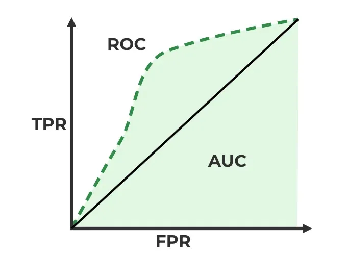

# Model Evaluation Metrics

---

## 1. Why Evaluation Metrics Matter

Before we touch formulas — a model that is 99% "accurate" can be completely useless. If you're predicting a rare disease that occurs in 1% of people, a model that always says "no disease" is 99% accurate and 100% worthless. This single idea — **accuracy can lie** — is the reason this whole topic exists. Interviewers love probing this because it separates people who memorized formulas from people who understand *when* to trust a number.

---

## 2. The Confusion Matrix

This is the foundation. Everything else in classification metrics is built on top of it.

For a **binary classifier** (say, predicting "Disease" vs "No Disease"), we compare what the model predicted against what actually happened.

| | Predicted Positive | Predicted Negative |
|---|---|---|
| **Actual Positive** | True Positive (TP) | False Negative (FN) |
| **Actual Negative** | False Positive (FP) | True Negative (TN) |

**Simple words for each cell:**

- **TP (True Positive):** Model said "yes", and it was actually "yes". ✅ Correct catch.
- **TN (True Negative):** Model said "no", and it was actually "no". ✅ Correct rejection.
- **FP (False Positive):** Model said "yes", but it was actually "no". ❌ **Type I Error** — a false alarm.
- **FN (False Negative):** Model said "no", but it was actually "yes". ❌ **Type II Error** — a missed catch.

**Memory trick:** The *second word* (Positive/Negative) is what the model predicted. The *first word* (True/False) tells you whether that prediction was correct.

**Real-life anchor example — Disease Detection:**
- TP: Patient has cancer, model says cancer → caught it correctly.
- TN: Patient is healthy, model says healthy → correctly cleared.
- FP: Patient is healthy, model says cancer → scared a healthy person, extra tests (costly, but not deadly).
- FN: Patient has cancer, model says healthy → **worst case**, disease goes untreated.

This example alone answers 80% of "precision vs recall" interview questions — keep it in your back pocket.

---

## 3. Core Classification Metrics

### 3.1 Accuracy

The fraction of total predictions the model got right.

$$
\text{Accuracy} = \frac{TP + TN}{TP + TN + FP + FN}
$$

**Good when:** Classes are balanced (roughly equal positives and negatives) and both types of errors cost about the same.

**Bad when:** Classes are imbalanced. This is the "accuracy paradox" — a lazy model that always predicts the majority class scores high accuracy while being useless.

### 3.2 Precision (a.k.a. Positive Predictive Value)

Out of everything the model *called* positive, how many were actually positive?

$$
\text{Precision} = \frac{TP}{TP + FP}
$$

**In simple words:** "When my model raises an alarm, how often is it right?" Precision punishes **False Positives**.

### 3.3 Recall (a.k.a. Sensitivity, True Positive Rate / TPR, Hit Rate)

Out of all the *actual* positives, how many did the model catch?

$$
\text{Recall} = \text{TPR} = \frac{TP}{TP + FN}
$$

**In simple words:** "Of all the real positive cases out there, how many did I not miss?" Recall punishes **False Negatives**.

### 3.4 Specificity (a.k.a. True Negative Rate)

Out of all the actual negatives, how many did the model correctly identify as negative?

$$
\text{Specificity} = \text{TNR} = \frac{TN}{TN + FP}
$$

**In simple words:** The "recall" for the negative class — how good the model is at correctly clearing healthy/negative cases.

### 3.5 False Positive Rate (FPR)

$$
\text{FPR} = \frac{FP}{FP + TN} = 1 - \text{Specificity}
$$

This is the x-axis of the ROC curve. It answers: "Of all the actual negatives, what fraction did I wrongly flag?"

### 3.6 F1 Score

Precision and Recall usually trade off against each other — improving one often hurts the other. F1 is the **harmonic mean** of the two, giving you one number that balances both.

$$
F_1 = 2 \times \frac{\text{Precision} \times \text{Recall}}{\text{Precision} + \text{Recall}}
$$

**Why harmonic mean and not simple average?** The harmonic mean punishes extreme imbalance. If Precision = 1.0 and Recall = 0.0, the simple average is 0.5 (looks decent), but the harmonic mean is 0 (correctly tells you the model is useless for recall). Harmonic mean is dragged down by the smaller value — so a good F1 score genuinely requires *both* precision and recall to be reasonably good.

### 3.7 F-beta Score

A generalized version of F1 that lets you decide how much more you care about Recall vs Precision using a parameter **β (beta)**.

$$
F_\beta = (1 + \beta^2) \times \frac{\text{Precision} \times \text{Recall}}{(\beta^2 \times \text{Precision}) + \text{Recall}}
$$

- **β = 1** → F1 score (equal weight to precision and recall).
- **β < 1** (e.g., β = 0.5) → **Precision matters more.** Use when False Positives are costlier (e.g., spam filter — don't wrongly block important emails).
- **β > 1** (e.g., β = 2) → **Recall matters more.** Use when False Negatives are costlier (e.g., cancer screening — don't miss a sick patient).

**Memory trick:** Think of β as a dial. Turn it up → you're dialing up the importance of Recall.

---

## 4. Precision vs Recall — When to Use What

This is one of the most-asked conceptual interview questions. The answer always depends on **which error is more expensive in the real world.**

### Choose high RECALL when False Negatives are dangerous/costly
*(You'd rather have some false alarms than miss a real case.)*

| Real-life example | Why |
|---|---|
| Cancer / disease screening | Missing a sick patient (FN) can be fatal. A false alarm (FP) just means an extra test. |
| Airport security / bomb detection | Missing a real threat is catastrophic. Flagging an innocent bag is just an inconvenience. |
| Fraud detection (initial flagging stage) | Missing actual fraud costs money and trust. A false flag just means a manual review. |

### Choose high PRECISION when False Positives are dangerous/costly
*(You'd rather miss a few cases than cry wolf too often.)*

| Real-life example | Why |
|---|---|
| Spam email filter | Blocking a real, important email (FP) is worse than letting one spam email through (FN). |
| YouTube/content recommendation | Recommending an irrelevant video (FP) annoys users; missing one good video (FN) is low cost. |
| Court conviction (in the "guilty" positive class) | Convicting an innocent person (FP) is a much graver error than a guilty person going free (FN) — "innocent until proven guilty" is essentially a precision-first philosophy. |

**Rule of thumb to say in an interview:**
> "I look at the cost of each error type in the business context. If missing a positive case is expensive or dangerous, I optimize for Recall. If a false alarm is expensive or erodes trust, I optimize for Precision. When both matter and I need one number, I use F1 (or F-beta if one error is worse than the other)."

---

## 5. ROC Curve and AUC

- **ROC Curve** plots **TPR (Recall)** on the y-axis against **FPR** on the x-axis at various classification thresholds.

     
    <em>Figure 1: AUC-ROC</em>

- **AUC (Area Under Curve)** summarizes the ROC curve into one number between 0 and 1.
  - AUC = 0.5 → model is no better than random guessing.
  - AUC = 1.0 → perfect classifier.
- AUC is **threshold-independent** — useful when you haven't decided on a final decision cut-off yet, or want to compare models overall.
- Use **Precision-Recall curve** instead of ROC when data is **highly imbalanced** — ROC can look overly optimistic on imbalanced data because TN is huge and dominates FPR.

---

## 6. Regression Evaluation Metrics

Classification metrics won't work for continuous outputs (like predicting house price or temperature). Here we measure how far predictions are from actual values.

Let $y_i$ = actual value, $\hat{y}_i$ = predicted value, $n$ = number of data points.

### 6.1 MAE (Mean Absolute Error)

$$
\text{MAE} = \frac{1}{n}\sum_{i=1}^{n} |y_i - \hat{y}_i|
$$

**Simple words:** Average of the absolute errors. Treats every error equally, regardless of size. Easy to interpret — same unit as your target variable (e.g., "off by ₹5,000 on average").

**Robust to outliers** — one huge error doesn't blow it up disproportionately.

### 6.2 MSE (Mean Squared Error)

$$
\text{MSE} = \frac{1}{n}\sum_{i=1}^{n} (y_i - \hat{y}_i)^2
$$

**Simple words:** Average of squared errors. Squaring does two things:
1. Removes negative signs (so errors don't cancel out).
2. **Punishes large errors much more heavily** than small ones (an error of 10 contributes 100, an error of 2 only contributes 4).

**Downside:** Very sensitive to outliers — one bad prediction can dominate the whole metric. Also, the unit is squared (e.g., "rupees²"), which is hard to interpret directly.

### 6.3 RMSE (Root Mean Squared Error)

$$
\text{RMSE} = \sqrt{\text{MSE}} = \sqrt{\frac{1}{n}\sum_{i=1}^{n} (y_i - \hat{y}_i)^2}
$$

**Simple words:** Just the square root of MSE, which brings the unit back to the original scale (e.g., rupees, not rupees²). Still sensitive to outliers (because it's built on MSE), but more interpretable than MSE.

**MAE vs RMSE quick comparison:**
- RMSE ≥ MAE always.
- If RMSE is much bigger than MAE → there are some large errors/outliers being punished heavily.
- If RMSE ≈ MAE → errors are fairly uniform in size.

### 6.4 Huber Loss

A hybrid that tries to get the best of both MAE and MSE. It behaves like MSE for small errors (smooth, good gradients for optimization) and like MAE for large errors (robust to outliers).

$$
L_\delta(y, \hat{y}) =
\begin{cases}
\frac{1}{2}(y - \hat{y})^2 & \text{if } |y - \hat{y}| \le \delta \\
\delta \cdot \left(|y - \hat{y}| - \frac{1}{2}\delta\right) & \text{if } |y - \hat{y}| > \delta
\end{cases}
$$

**Simple words:** δ (delta) is a threshold you choose. Small errors (below δ) get the smooth "squared" treatment. Large errors (above δ, likely outliers) get the "linear/absolute" treatment so they don't dominate training. Very popular in robust regression and as a loss function in gradient boosting models.

### 6.5 R² (R-squared / Coefficient of Determination)

$$
R^2 = 1 - \frac{SS_{res}}{SS_{tot}} = 1 - \frac{\sum_{i}(y_i - \hat{y}_i)^2}{\sum_{i}(y_i - \bar{y})^2}
$$

Where $\bar{y}$ is the mean of actual values, $SS_{res}$ is the sum of squared residuals (your model's errors), and $SS_{tot}$ is the total variance in the data (errors if you just predicted the mean every time).

**Simple words:** "What fraction of the variation in the target variable does my model explain, compared to a dumb baseline model that always predicts the average?"
- R² = 1 → perfect model.
- R² = 0 → model is no better than just guessing the mean every time.
- R² can go **negative** → model is worse than guessing the mean (a real risk with bad models or wrong features).

**The catch:** R² **always increases (or stays the same) when you add more features** — even completely useless, random ones. This makes it misleading for comparing models with a different number of features.

### 6.6 Adjusted R²

Fixes the "R² always goes up" problem by penalizing you for adding features that don't actually help.

$$
\text{Adjusted } R^2 = 1 - \left[\frac{(1 - R^2)(n - 1)}{n - k - 1}\right]
$$

Where $n$ = number of data points, $k$ = number of predictors/features.

**Simple words:** Adjusted R² only goes up if the new feature improves the model by *more than what you'd expect by pure chance*; otherwise it goes down. **Always prefer Adjusted R² over R² when comparing models with different numbers of features.**

---

## 7. How to Improve Model Performance

### 7.1 For Regression Models
- **Feature engineering:** create polynomial/interaction terms, log-transform skewed features, handle outliers.
- **Feature selection:** remove irrelevant/redundant features (helps Adjusted R², reduces overfitting) — use techniques like VIF (multicollinearity check), Lasso (L1) regularization, recursive feature elimination.
- **Regularization:** Ridge (L2) shrinks coefficients to reduce overfitting/variance; Lasso (L1) can shrink coefficients to exactly zero (automatic feature selection); Elastic Net = combination of both.
- **Handle multicollinearity:** correlated features destabilize coefficient estimates — check VIF (Variance Inflation Factor), drop/combine correlated features.
- **Try non-linear models:** if relationships aren't linear — Decision Trees, Random Forest, Gradient Boosting (XGBoost/LightGBM), or add polynomial features to linear models.
- **Scale features:** especially for gradient-descent-based or distance-based models (helps convergence and fairness across features).
- **Handle outliers:** cap/floor (winsorize), transform (log/Box-Cox), or use robust loss functions (Huber loss).
- **More/better data:** more rows reduce variance; better quality (less noise, fewer missing values) reduces bias.
- **Hyperparameter tuning:** GridSearchCV, RandomSearchCV, or Bayesian optimization (Optuna).
- **Ensembling:** bagging (Random Forest) reduces variance, boosting (XGBoost/LightGBM/GradientBoosting) reduces bias, stacking combines multiple model types.

### 7.2 For Classification Models
- **Handle class imbalance:**
  - Resampling: SMOTE (synthetic oversampling of minority class), random undersampling of majority class.
  - Class weights: penalize misclassifying the minority class more heavily (`class_weight='balanced'` in sklearn).
  - Use appropriate metrics: don't rely on accuracy — use F1, Precision-Recall AUC, or Cohen's Kappa.
- **Threshold tuning:** the default 0.5 cutoff isn't always right — shift it based on your Precision/Recall priorities (use the Precision-Recall curve to pick it).
- **Feature engineering & selection:** same principles as regression.
- **Try different algorithms:** Logistic Regression → Tree-based models → Boosting, depending on data complexity.
- **Regularization:** L1/L2 penalty in Logistic Regression to prevent overfitting.
- **Cross-validation + hyperparameter tuning:** to make sure performance generalizes, not just memorizes.
- **Ensembling:** Random Forest, XGBoost, LightGBM, CatBoost, or stacking multiple classifiers.
- **Calibrate probabilities:** if you need well-calibrated probability outputs (not just class labels), use Platt Scaling or Isotonic Regression.
- **More/cleaner data & better labels:** noisy labels cap your ceiling no matter how good the model is.

---

## 8. Cross-Validation

Cross-validation exists to answer one question honestly: **"How will my model perform on data it hasn't seen?"** Testing only on your training data gives a falsely optimistic picture (the model has already "seen the answers").

### 8.1 Train-Test Split

The simplest approach — split data once, typically 70-80% train, 20-30% test.

**Pros:** Fast, simple, easy to implement.
**Cons:** Performance estimate depends heavily on *which* rows landed in the test set — a lucky or unlucky split can mislead you. Especially risky with small datasets.

### 8.2 Leave-One-Out Cross-Validation (LOOCV)

Extreme case where **k = n** (number of data points). For each iteration, train on all data points except one, test on that single left-out point, and repeat for every single point.

**Pros:** Uses maximum possible data for training every time; no randomness in splits (deterministic); good for very small datasets.
**Cons:** Extremely computationally expensive (train n models for n data points); high variance in the estimate because each test set is a single point; less used in practice for large datasets.

### 8.3 k-Fold Cross-Validation

Split data into **k equal parts (folds)**. Train on k−1 folds, test on the remaining 1 fold, repeat k times so every fold gets to be the test set once. Average the k performance scores for the final estimate.

**Common choice:** k = 5 or k = 10 (good balance of bias, variance, and compute cost).

**Pros:** More reliable estimate than a single train-test split (uses all data for both training and testing across folds); less variance than LOOCV; computationally more feasible than LOOCV.
**Cons:** Still more expensive than a single train-test split; choice of k matters (too small → high bias in estimate; too large → high variance, more compute, approaches LOOCV).

**Stratified k-Fold:** a must-know variant for classification — ensures each fold has roughly the same class distribution as the full dataset. Critical for imbalanced datasets, otherwise a fold could end up with zero or very few minority-class samples.

**Time Series Cross-Validation (a related, often-asked topic):** You **cannot** randomly shuffle time series data into folds — that would leak future information into training. Instead, use **forward chaining / expanding window**: train on data up to time t, test on t+1 onward, then expand the training window and repeat.

---

## 9. Bias-Variance Tradeoff

This is the single most important conceptual pillar underlying "why models perform well or poorly," and it's asked in nearly every ML interview.

### Definitions

- **Bias:** Error from overly simplistic assumptions in the model. In simple words, it is the model's error rate on training set. High bias means the model is too simple to capture the true underlying pattern → **underfitting**. (Model performs poorly on both train and test data.)
- **Variance:** Error from the model being overly sensitive to small fluctuations/noise in the training data. In simple words, Variance tells us how much worse the model does on the test set than the training set. High variance means the model memorizes the training data too closely → **overfitting**. (Model performs great on train, poorly on test.)

### The Math (Expected Total Error Decomposition)

$$
\text{Total Error} = \text{Bias}^2 + \text{Variance} + \text{Irreducible Error}
$$

- **Irreducible error:** noise inherent in the data itself — no model can ever eliminate this (e.g., measurement error, randomness).

### The Tradeoff

As model complexity increases:
- Bias tends to **decrease** (model can capture more nuanced patterns).
- Variance tends to **increase** (model starts fitting noise, not just signal).

The goal is to find the **sweet spot** — the complexity level that minimizes *total* error, not bias or variance alone.

**Visual intuition (describe this in an interview if no whiteboard is available):**
Imagine a U-shaped curve for test error vs model complexity. Training error keeps dropping as complexity increases, but test error drops, hits a minimum, then rises again — that minimum point is your ideal complexity/sweet spot.

| | Underfitting (High Bias) | Good Fit | Overfitting (High Variance) |
|---|---|---|---|
| Train error | High | Low | Very low |
| Test error | High | Low | High |
| Example model | Linear regression on non-linear data | Well-tuned model | Very deep, unpruned decision tree |
| Fix | Increase complexity, add features | — | Regularize, simplify, get more data, prune |

**How to fix each:**
- **High bias (underfitting):** use a more complex model, add more/better features, reduce regularization strength, train longer.
- **High variance (overfitting):** get more training data, use regularization (L1/L2), reduce model complexity (fewer features/lower tree depth), use ensembling (bagging), use dropout (neural nets), early stopping, cross-validation to catch it early.

---

## 10. Common & Tricky Interview Questions with Expert Answers

**Q1. Why is accuracy a bad metric for imbalanced datasets?**
> Because a naive model that always predicts the majority class can score very high accuracy while providing zero business value. Example: in fraud detection where only 1% of transactions are fraud, a model predicting "not fraud" every single time is 99% accurate but catches zero fraud. Use Precision, Recall, F1, or PR-AUC instead.

**Q2. Can you have 100% Recall trivially? How?**
> Yes — just predict "positive" for every single sample. Then FN = 0, so Recall = TP/(TP+0) = 1. But Precision would crash because of massive False Positives. This is exactly why Recall alone is meaningless without checking Precision alongside it — always look at both, or use F1/F-beta.

**Q3. Why do we square errors in MSE instead of just using absolute error?**
> Two reasons: (1) squaring guarantees positive values so errors don't cancel each other out (an alternative to absolute value), and (2) squaring is differentiable everywhere, including at zero — unlike absolute value which has a sharp corner at 0. This differentiability matters a lot for gradient-based optimization (like gradient descent), which is why MSE is the default loss for many regression models.

**Q4. Why can R² be negative?**
> R² compares your model's errors to a baseline model that just predicts the mean every time. If your actual model does *worse* than that trivial baseline (e.g., due to bad features, wrong model choice, or overfitting evaluated on new data), the residual sum of squares exceeds the total sum of squares, making the ratio greater than 1, and 1 minus that becomes negative.

**Q5. Why does R² always increase when you add more features, and how do you fix this?**
> Adding any feature — even random noise — gives the model one more degree of freedom to fit the training data slightly better, so residual error can only go down or stay flat, never increase. This inflates R² misleadingly. Adjusted R² fixes this by penalizing the addition of features that don't meaningfully reduce error, using the number of predictors (k) and sample size (n) in its formula.

**Q6. What's the difference between Type I and Type II errors, and which is worse?**
> Type I = False Positive (false alarm), Type II = False Negative (missed detection). Neither is "worse" in the abstract — it entirely depends on context/cost. In medical screening, Type II (missing a sick patient) is usually worse. In criminal justice, Type I (convicting an innocent person) is usually considered worse. Always frame your answer around the business/real-world cost of each error type.

**Q7. When would you choose F-beta over plain F1?**
> When one error type is clearly more costly than the other and you still want a single combined metric. Use β > 1 (e.g., F2) when Recall matters more (e.g., disease screening — don't miss cases). Use β < 1 (e.g., F0.5) when Precision matters more (e.g., spam filtering — don't block real emails).

**Q8. Why is MAE considered more robust to outliers than MSE/RMSE?**
> MAE grows linearly with the size of the error, while MSE grows quadratically (error²). So one huge outlier error contributes disproportionately more to MSE/RMSE than to MAE. If your data has heavy outliers you don't want to be dominated by, MAE (or Huber loss) is a better choice.

**Q9. What does an AUC of 0.5 mean? What about below 0.5?**
> AUC = 0.5 means the model has zero discriminative power — equivalent to random guessing/coin flip. AUC below 0.5 technically means the model is doing *worse* than random, which usually indicates the model's predictions are inverted (in which case, flipping the predicted labels would actually give you AUC = 1 − original AUC, better than random!).

**Q10. Explain bias-variance tradeoff with a simple analogy.**
> Imagine shooting arrows at a target. High bias = your shots are consistently off-center in one direction, clustered tightly but away from the bullseye (systematically wrong — underfitting). High variance = your shots are scattered all over the target, sometimes near bullseye, sometimes far, with no consistency (unstable — overfitting, super sensitive to small changes). The ideal archer has both low bias and low variance — shots tightly clustered right at the bullseye.

**Q11. Your model has 95% train accuracy but only 65% test accuracy. What's happening and what would you do?**
> Classic overfitting (high variance) — the model memorized the training data's noise instead of learning generalizable patterns. Fixes: get more training data, add regularization (L1/L2), reduce model complexity (fewer features, lower tree depth, prune the tree), use dropout (for neural nets), use ensembling like bagging (Random Forest), and always validate with cross-validation during development to catch this before deployment.

**Q12. Why can't you shuffle data randomly for cross-validation in a time series problem?**
> Random shuffling would let the model "see the future" during training — for instance, training on data from March while testing on data from January, when in the real world January's prediction can never legitimately use March's information. This is called data leakage. Instead, use time-based splits (forward chaining/expanding window) that always train on the past and test on the future.

**Q13. Precision and Recall are both 1.0 for a fraud model on your test set of 10,000 transactions with 5 actual fraud cases. Should you be suspicious?**
> Yes — this is a huge red flag with such a tiny minority class (5 out of 10,000). Perfect scores on so few positive examples could mean data leakage (e.g., a feature that directly encodes the label, like a "flagged_by_bank" column), or the test set is simply too small/unrepresentative to trust the metric. Always sanity-check suspiciously perfect scores, especially with small positive class counts — investigate feature leakage and re-validate with cross-validation or a larger/different test set.

**Q14. Is a high Adjusted R² always a sign of a good model?**
> No. Adjusted R² only tells you about *linear explanatory power on the training data* — it says nothing about whether assumptions (linearity, homoscedasticity, no multicollinearity) hold, whether the model generalizes to new/unseen data, or whether the relationships are causal. Always check residual plots, cross-validated performance, and test-set metrics alongside it.

**Q15. What is the relationship between k in k-fold CV and bias/variance of the performance estimate itself?**
> Smaller k (e.g., k=2) → each training fold is smaller (less data to learn from) → the model itself tends to have higher bias, and the performance estimate has lower variance (fewer, larger test folds averaged). Larger k (e.g., k=n, i.e., LOOCV) → each training fold is nearly the full dataset (low bias in the trained model) → but the performance estimate has higher variance because the k models are all trained on nearly-identical, highly correlated data, and test sets are tiny/noisy. k=5 or k=10 is the standard practical sweet spot.

---

## 11. Other Crucial Aspects Worth Knowing

- **Log Loss (Cross-Entropy Loss):** the actual loss function most classifiers optimize during training (not just an evaluation metric). Rewards confident *and correct* predictions, heavily penalizes confident *wrong* predictions.
$$
\text{Log Loss} = -\frac{1}{n}\sum_{i=1}^{n}\left[y_i \log(\hat{p}_i) + (1-y_i)\log(1-\hat{p}_i)\right]
$$

- **Cohen's Kappa:** measures agreement between predicted and actual labels while correcting for the agreement expected by pure chance — very useful for imbalanced multi-class problems.

- **Macro vs Micro vs Weighted averaging (multi-class metrics):**
  - **Macro:** compute metric per class, then take a simple average (treats all classes equally, sensitive to rare-class performance).
  - **Micro:** aggregate TP/FP/FN across all classes first, then compute the metric globally (dominated by frequent classes).
  - **Weighted:** like macro, but weighted by the number of true instances of each class (accounts for class imbalance while still evaluating per-class).

- **Confusion matrix for multi-class:** becomes an N×N matrix; diagonal = correct predictions, off-diagonal = specific misclassification patterns (very useful for spotting which classes get confused with which).

- **MAPE (Mean Absolute Percentage Error):** expresses error as a percentage of the actual value — intuitive for business stakeholders, but undefined/unstable when actual values are near zero.
$$
\text{MAPE} = \frac{100\%}{n}\sum_{i=1}^{n}\left|\frac{y_i - \hat{y}_i}{y_i}\right|
$$

- **Calibration vs Discrimination:** a model can rank cases correctly (good AUC/discrimination) but still output poorly calibrated probabilities (e.g., always predicting 0.9 when the true rate is 0.6). Check calibration plots if downstream decisions rely on the actual probability values, not just the ranking.

- **Data leakage** is the silent killer of evaluation metrics — always double check that no test-set information (directly or indirectly) touched the training process, feature engineering, or preprocessing steps (e.g., scaling using statistics from the full dataset instead of only the training fold).

- **Always evaluate on a metric aligned with business objective**, not just whatever's convenient. A model optimized for accuracy might be the wrong choice if the real business cost is asymmetric between FP and FN.

---

## 12. Quick-Reference Formula Cheat Sheet

| Metric | Formula |
|---|---|
| Accuracy | (TP+TN)/(TP+TN+FP+FN) |
| Precision | TP/(TP+FP) |
| Recall / TPR / Sensitivity | TP/(TP+FN) |
| Specificity / TNR | TN/(TN+FP) |
| FPR | FP/(FP+TN) = 1 − Specificity |
| F1 Score | 2·(P·R)/(P+R) |
| F-beta | (1+β²)·(P·R)/((β²·P)+R) |
| MAE | (1/n)Σ\|yᵢ − ŷᵢ\| |
| MSE | (1/n)Σ(yᵢ − ŷᵢ)² |
| RMSE | √MSE |
| R² | 1 − SSres/SStot |
| Adjusted R² | 1 − [(1−R²)(n−1)/(n−k−1)] |
| Log Loss | −(1/n)Σ[y·log(p) + (1−y)·log(1−p)] |

---

