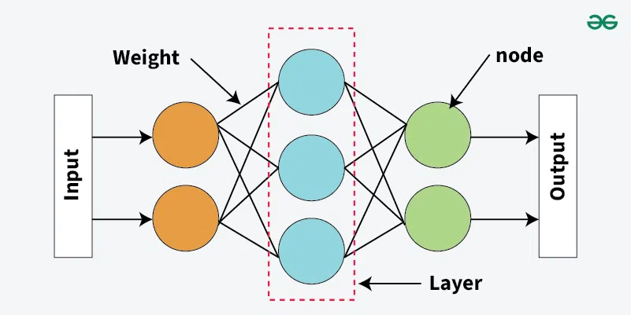

# Neural Networks
---

## 1. What is a Neural Network? (Definition & Intuition)

A **Neural Network (NN)** is a machine learning model inspired loosely by how neurons in the brain work. It's basically a **chain of mathematical functions** stacked in layers that learns to map an input (like an image, a number, or text) to an output (like a label or a prediction) by adjusting internal numbers called **weights**.

Think of it like a factory assembly line:
- Raw material (input data) enters.
- It passes through several workstations (layers), each one transforming it a bit.
- The final product (output/prediction) comes out at the end.
- If the product is defective (wrong prediction), we go back and adjust each workstation's settings (weights) so next time the product is better. That "going back and adjusting" is **backpropagation**.

**Why do we need them?** Simple models like linear regression can only draw straight lines. Real-world problems (images, speech, text) have complex, non-linear patterns. Neural networks, especially with non-linear activation functions, can approximate almost any function — this is called the **Universal Approximation Theorem**.

---

## 2. Basic Architecture: Layers, Nodes, Bias

### Layers
A neural network has three types of layers:

1. **Input Layer** — Just receives the raw features. No computation happens here. Number of nodes = number of input features.
2. **Hidden Layer(s)** — This is where the actual "learning" and transformation happens. A network can have 1 hidden layer (shallow) or many (deep — hence "Deep Learning").
3. **Output Layer** — Produces the final prediction. Number of nodes depends on the task:
   - Regression → 1 node (or more for multi-output regression)
   - Binary classification → 1 node (sigmoid)
   - Multi-class classification → N nodes (softmax), N = number of classes

### Nodes (Neurons)
Each node does two things:
1. **Weighted sum**: takes all inputs, multiplies each by a weight, adds a bias.
2. **Activation**: passes that sum through a non-linear function.

$$z = w_1x_1 + w_2x_2 + ... + w_nx_n + b = \mathbf{w}^T\mathbf{x} + b$$
$$a = f(z)$$

Where `f` is the activation function.

### Bias
Bias is an extra learnable parameter added to the weighted sum — think of it as the "y-intercept" in a line equation `y = mx + c`. Without bias, every function the network learns is forced to pass through the origin, which severely limits flexibility. Bias lets the activation function **shift left or right**, giving the network more freedom to fit the data.

**Simple analogy**: Weights decide *how much attention* to pay to each input; bias decides *the baseline* output even when all inputs are zero.

### Data Flow Summary
```
Input Layer  →  Hidden Layer 1  →  Hidden Layer 2  →  ...  →  Output Layer
  (features)      (z=Wx+b, a=f(z))                              (prediction)
```
This left-to-right flow of data is called **Forward Propagation** (explained in detail in Section 5).

<p align="center">
    <br>
    <em>Figure 1: Neural Network</em>
</p>
---

## 3. Activation Functions

**Why do we need them?** If we don't use a non-linear activation function, no matter how many layers we stack, the whole network mathematically collapses into a single linear function (because a linear function of a linear function is still linear). Activation functions inject **non-linearity**, which lets the network model complex, curved decision boundaries.

| Function | Formula | Range | Pros | Cons |
|---|---|---|---|---|
| **Sigmoid** | $\frac{1}{1+e^{-z}}$ | (0,1) | Smooth, good for probabilities/output layer of binary classification | Vanishing gradient for large \|z\|; not zero-centered; slow convergence |
| **Tanh** | $\frac{e^z-e^{-z}}{e^z+e^{-z}}$ | (-1,1) | Zero-centered (better than sigmoid), stronger gradients than sigmoid | Still suffers vanishing gradient at extremes |
| **ReLU** (Rectified Linear Unit) | $\max(0,z)$ | [0,∞) | Computationally cheap, no vanishing gradient for z>0, fast convergence, most popular for hidden layers | "Dying ReLU" — neurons stuck outputting 0 forever if z<0 consistently |
| **Leaky ReLU** | $z$ if $z>0$ else $\alpha z$ (small α like 0.01) | (-∞,∞) | Fixes dying ReLU by allowing small negative slope | α is a hyperparameter to tune; not always better in practice |
| **Parametric ReLU (PReLU)** | Like Leaky ReLU but α is learned | (-∞,∞) | More flexible than Leaky ReLU | Extra parameter, risk of overfitting |
| **ELU** | $z$ if $z>0$ else $\alpha(e^z-1)$ | (-α,∞) | Smooth, pushes mean activation closer to 0, reduces bias shift | More expensive to compute (exponential) |
| **Softmax** | $\frac{e^{z_i}}{\sum_j e^{z_j}}$ | (0,1), sums to 1 | Converts scores to probability distribution — used in output layer for multi-class classification | Only makes sense at output layer, not hidden layers |
| **Swish / GELU** | $z \cdot \text{sigmoid}(z)$ (Swish) | (-∞,∞) | Smooth, used in modern architectures (Transformers use GELU), often outperforms ReLU on deep nets | More compute cost, less interpretable |

**Interview tip**: Default choice for hidden layers today = **ReLU** (or its variants). Output layer choice depends on task:
- Binary classification → Sigmoid
- Multi-class classification → Softmax
- Regression → No activation (linear) or identity

---

## 4. Cost Function (Loss Function)

The **cost function** (aka loss function) measures how wrong the network's predictions are compared to actual values. Training = trying to **minimize** this cost.

- **Loss** = error for a single training example.
- **Cost** = average loss over the entire training batch/dataset.

### Common Cost Functions

**1. Mean Squared Error (MSE)** — used for regression:
$$J = \frac{1}{n}\sum_{i=1}^{n}(y_i - \hat{y}_i)^2$$

**2. Binary Cross-Entropy (Log Loss)** — used for binary classification:
$$J = -\frac{1}{n}\sum_{i=1}^{n}\left[y_i\log(\hat{y}_i) + (1-y_i)\log(1-\hat{y}_i)\right]$$

**3. Categorical Cross-Entropy** — used for multi-class classification (with softmax output):
$$J = -\frac{1}{n}\sum_{i=1}^{n}\sum_{c=1}^{C} y_{i,c}\log(\hat{y}_{i,c})$$

**Why cross-entropy and not MSE for classification?** MSE with sigmoid creates a non-convex, slow-learning error surface for classification (gradients become very small/flat). Cross-entropy pairs mathematically well with sigmoid/softmax and produces much cleaner, larger gradients when the prediction is wrong — leading to faster learning.

---

## 5. Forward Propagation

Forward propagation is simply passing input data through the network, layer by layer, to get a final output/prediction.

**Step by step for a layer `l`:**
$$Z^{[l]} = W^{[l]}A^{[l-1]} + b^{[l]}$$
$$A^{[l]} = f^{[l]}(Z^{[l]})$$

Where:
- $A^{[l-1]}$ = activations from previous layer (or input `X` if it's the first layer)
- $W^{[l]}$ = weight matrix of layer `l`
- $b^{[l]}$ = bias vector of layer `l`
- $f^{[l]}$ = activation function of layer `l`

This repeats layer by layer until we reach $\hat{y} = A^{[L]}$ (output of the last layer `L`). Then we compute the cost `J` by comparing $\hat{y}$ to the true label `y`.

---

## 6. Backward Propagation (Backpropagation)

This is the heart of how neural networks "learn." After forward propagation gives us the cost, we need to know: **how should each weight change to reduce the cost?** That's what backprop calculates — the gradient of the cost with respect to every weight and bias, using the **chain rule of calculus**.

### Intuition
Imagine the cost function as a hilly landscape and the weights as your current position. The gradient tells you the **direction of steepest ascent**. To reduce cost, you move in the **opposite direction** of the gradient — that's Gradient Descent (Section 8).

### The Math (Chain Rule)
For the output layer:
$$dZ^{[L]} = A^{[L]} - Y \quad \text{(for softmax/sigmoid + cross-entropy — a beautifully simple result)}$$

Then, working backward layer by layer:
$$dW^{[l]} = \frac{1}{m}dZ^{[l]}A^{[l-1]T}$$
$$db^{[l]} = \frac{1}{m}\sum dZ^{[l]}$$
$$dA^{[l-1]} = W^{[l]T}dZ^{[l]}$$
$$dZ^{[l-1]} = dA^{[l-1]} * f'^{[l-1]}(Z^{[l-1]})$$

(`*` = element-wise multiplication, `m` = number of training examples)

**In plain English**: We compute how much the cost changes with respect to the output, then "propagate" that error backward through each layer, using the chain rule to compute how much each weight contributed to the final error. Once we have these gradients, we update weights using an optimizer (Section 8).

**Why is it called "back"-propagation?** Because the error signal flows from the output layer back to the input layer — opposite direction to forward prop.

---

## 7. Weight Initialization

How you set the *starting* values of weights matters a lot.

- **Zero initialization** → BAD. If all weights start at 0, every neuron in a layer computes the exact same output and gets the exact same gradient update — they never differentiate ("symmetry problem"). The network effectively behaves like it has only 1 neuron per layer.
- **Random initialization (small random values)** → Better, but if the scale is wrong, it can still cause vanishing/exploding gradients in deep networks.
- **Xavier/Glorot Initialization** → Designed for sigmoid/tanh activations. Sets variance of weights = $\frac{1}{n_{in}}$ (or $\frac{2}{n_{in}+n_{out}}$), keeping the variance of activations roughly constant across layers.
- **He Initialization** → Designed for ReLU activations. Sets variance = $\frac{2}{n_{in}}$. Since ReLU zeroes out half the inputs on average, this compensates by using a bigger variance.

**Rule of thumb**: ReLU → He init. Tanh/Sigmoid → Xavier init.

---

## 8. Optimizers

Optimizers decide **how weights get updated** using the gradients computed in backprop. The general update rule is:
$$W = W - \eta \cdot dW$$
where $\eta$ (eta) is the **learning rate** — how big a step we take.

### 1. Batch Gradient Descent (Vanilla GD)
Uses the **entire training dataset** to compute the gradient before making a single update.
- **How it works**: Forward + backward pass on all `m` examples, average the gradients, then update weights once per epoch.
- **Pros**: Stable, smooth convergence; gradient estimate is accurate.
- **Cons**: Very slow for large datasets (one update per full pass through data); needs the whole dataset in memory.

### 2. Stochastic Gradient Descent (SGD)
Updates weights after **every single training example**.
- **Pros**: Fast updates, can escape shallow local minima due to noisy updates, works with huge/streaming datasets.
- **Cons**: Very noisy convergence path (zig-zags), never really "settles" at the minimum, harder to vectorize efficiently.

### 3. Mini-Batch Gradient Descent
The practical middle ground — updates weights after a small batch (e.g., 32, 64, 128 examples).
- **Pros**: Balances speed and stability; can leverage vectorized/GPU computation; most widely used in practice.
- **Cons**: Introduces a new hyperparameter (batch size) that needs tuning.

### 4. Gradient Descent with Momentum
Adds a "velocity" term that accumulates past gradients, like a ball rolling downhill gathering speed.
$$V_{dW} = \beta V_{dW} + (1-\beta)dW$$
$$W = W - \eta V_{dW}$$
- **How it works**: Smooths out the noisy zig-zag path of SGD by averaging over past gradients (typically β=0.9).
- **Pros**: Faster convergence, dampens oscillations, helps navigate ravines in the loss surface.
- **Cons**: One more hyperparameter (β) to tune; can overshoot the minimum if momentum too high.

### 5. AdaGrad (Adaptive Gradient)
Adapts the learning rate **per parameter**, based on how frequently/largely that parameter has been updated.
$$W = W - \frac{\eta}{\sqrt{S_{dW}} + \epsilon}dW, \quad S_{dW} = S_{dW} + dW^2$$
- **Pros**: Great for sparse data (like NLP/text features) — rare features get bigger updates.
- **Cons**: $S_{dW}$ keeps growing, so the effective learning rate shrinks and eventually the model **stops learning** (learning rate decays too aggressively).

### 6. RMSProp (Root Mean Square Propagation)
Fixes AdaGrad's shrinking learning rate problem by using an **exponentially decaying average** of squared gradients instead of a cumulative sum.
$$S_{dW} = \beta S_{dW} + (1-\beta)dW^2$$
$$W = W - \frac{\eta}{\sqrt{S_{dW}}+\epsilon}dW$$
- **Pros**: Learning rate doesn't vanish over time like AdaGrad; works well for non-stationary/online problems and RNNs.
- **Cons**: Still sensitive to initial learning rate choice.

### 7. Adam (Adaptive Moment Estimation)
Combines **Momentum** (1st moment — mean of gradients) + **RMSProp** (2nd moment — variance of gradients). This is the most popular optimizer used today by default.
$$V_{dW} = \beta_1 V_{dW} + (1-\beta_1)dW \quad \text{(momentum)}$$
$$S_{dW} = \beta_2 S_{dW} + (1-\beta_2)dW^2 \quad \text{(RMSProp)}$$
Then bias-correction (since V and S start at 0, they're biased toward 0 early on):
$$V^{corrected}_{dW} = \frac{V_{dW}}{1-\beta_1^t}, \quad S^{corrected}_{dW} = \frac{S_{dW}}{1-\beta_2^t}$$
$$W = W - \frac{\eta}{\sqrt{S^{corrected}_{dW}}+\epsilon}V^{corrected}_{dW}$$
- **Pros**: Fast convergence, works well out-of-the-box with default hyperparameters ($\beta_1$=0.9, $\beta_2$=0.999), combines benefits of momentum and adaptive learning rates. Industry default.
- **Cons**: More memory (stores 2 moving averages per parameter); sometimes generalizes slightly worse than well-tuned SGD+momentum on some tasks; more hyperparameters.

**Quick comparison table:**

| Optimizer | Adapts LR per param? | Uses momentum? | Best for |
|---|---|---|---|
| Batch GD | No | No | Small datasets, convex problems |
| SGD | No | No | Online/streaming learning |
| Mini-batch GD | No | No | General purpose, default baseline |
| Momentum | No | Yes | Speeding up convergence, ravines |
| AdaGrad | Yes | No | Sparse data (NLP) |
| RMSProp | Yes | No | RNNs, non-stationary objectives |
| Adam | Yes | Yes | Default choice for most deep learning |

---

## 9. Regularization Techniques (Preventing Overfitting)

Overfitting = the model memorizes training data instead of learning generalizable patterns (low training error, high test error).

### L2 Regularization (Ridge / Weight Decay)
Adds a penalty proportional to the **square of weights** to the cost function:
$$J_{reg} = J + \frac{\lambda}{2m}\sum W^2$$
- **Effect**: Shrinks weights toward zero (but rarely exactly zero), keeping the model simpler and smoother.
- **Pros**: Reduces overfitting, keeps all features but with reduced influence, differentiable (easy for gradient-based optimization).
- **Cons**: Doesn't produce sparse models; requires tuning λ (regularization strength).

### L1 Regularization (Lasso)
Adds a penalty proportional to the **absolute value of weights**:
$$J_{reg} = J + \frac{\lambda}{m}\sum |W|$$
- **Effect**: Pushes many weights to **exactly zero** — performs automatic feature selection.
- **Pros**: Produces sparse models, useful when you suspect many features are irrelevant.
- **Cons**: Not differentiable at zero (needs sub-gradient methods), can be unstable when features are correlated.

### Dropout
During training, **randomly "turn off" (zero out)** a fraction `p` of neurons in a layer at each forward pass.
- **Why it works**: Forces the network to not rely too heavily on any single neuron, since any neuron could vanish at any time — this acts like training an ensemble of many smaller sub-networks and averaging them, which reduces overfitting.
- **Important detail**: At **test time**, dropout is turned off, but activations are scaled (typically using "inverted dropout" during training, dividing by `(1-p)`) so the expected output magnitude stays consistent.
- **Pros**: Very effective, simple to implement, computationally cheap.
- **Cons**: Increases training time to converge (noisier gradients), an extra hyperparameter (dropout rate) to tune, not very effective on very small networks.

### Other regularization mentions worth knowing
- **Early Stopping**: Stop training when validation loss starts increasing, even if training loss keeps falling.
- **Batch Normalization**: Normalizes layer inputs (mean 0, variance 1) per mini-batch — primarily speeds up training and stabilizes it, but also has a mild regularizing side-effect.
- **Data Augmentation**: Artificially increasing training data variety (e.g., rotating/flipping images) to improve generalization.

---

## 10. Vanishing & Exploding Gradients

This is a critical problem in **deep** networks (many layers), caused by the chain rule multiplying many numbers together during backprop.

### Vanishing Gradients
If activation function derivatives are small (like sigmoid/tanh, whose derivatives max out at 0.25 and 1.0 respectively but are usually much smaller), multiplying many small numbers together (one per layer) during backprop makes the gradient **shrink exponentially** as it flows back to earlier layers. Result: early layers learn extremely slowly or stop learning entirely.

**Symptoms**: Training loss plateaus early, deep layers' weights barely update, network doesn't improve.

**Fixes**:
- Use ReLU (and variants) instead of sigmoid/tanh in hidden layers.
- Use proper initialization (He/Xavier).
- Use Batch Normalization.
- Use residual/skip connections (like in ResNets) — lets gradients flow directly through shortcut paths.
- Use LSTM/GRU instead of vanilla RNN for sequence models (designed specifically to combat vanishing gradients).

### Exploding Gradients
The opposite problem — if weights are large, multiplying large numbers repeatedly through many layers makes gradients grow exponentially, causing huge, unstable weight updates (sometimes resulting in `NaN` values).

**Symptoms**: Loss suddenly becomes very large or `NaN`, training is unstable, weights oscillate wildly.

**Fixes**:
- **Gradient Clipping**: cap the gradient's norm/value at a threshold before applying the update.
- Proper weight initialization.
- Lower learning rate.
- Batch Normalization.

---

## 11. Other Vital Concepts (Beyond the Basics)

### Epoch, Batch, Iteration
- **Epoch** = one full pass through the entire training dataset.
- **Batch size** = number of samples processed before one weight update.
- **Iteration** = one weight update (= one mini-batch processed). So `iterations per epoch = total samples / batch size`.

### Learning Rate
Controls step size during optimization. Too high → overshoots minimum, diverges. Too low → painfully slow convergence, can get stuck in local minima/saddle points. **Learning rate schedules/decay** (reducing LR over time) and **warm-up** are common practical tricks.

### Bias-Variance Tradeoff
- **High bias** (underfitting) → model too simple, fails on both train and test data. Fix: bigger network, train longer, better features.
- **High variance** (overfitting) → model too complex, does great on train but poor on test. Fix: regularization, more data, dropout, early stopping.

### Local Minima vs Saddle Points
In high-dimensional spaces (which is what deep NNs operate in), true local minima are actually rare. **Saddle points** (flat in some directions, curved in others) are much more common obstacles, and momentum-based optimizers help escape them.

### Batch Normalization (BN)
Normalizes the output of a layer (subtract batch mean, divide by batch std) before passing to activation, then applies learnable scale (γ) and shift (β) parameters. Speeds up training significantly, allows higher learning rates, and reduces sensitivity to initialization.

### Computational Graphs & Autograd
Modern frameworks (PyTorch, TensorFlow) represent the forward pass as a graph of operations and automatically compute gradients via **automatic differentiation (autodiff)** — this is what makes backprop practical for arbitrarily complex architectures without hand-deriving every gradient.

### Loss Landscape / Convexity
Neural network cost functions are **non-convex** (unlike linear/logistic regression) — there can be many local minima and saddle points, but empirically, in deep networks, most local minima found via SGD-family optimizers tend to generalize similarly well.

### Softmax vs Sigmoid — When to use what
- Sigmoid: independent probabilities (multi-label — an image can be "cat" AND "cute" simultaneously).
- Softmax: mutually exclusive probabilities that sum to 1 (multi-class — an image is either "cat" OR "dog" OR "bird").

---

## 12. Common & Tricky Interview Questions (With Expert Answers)

**Q1: Why do we need non-linear activation functions? What happens if we don't use any?**
> Without non-linear activations, no matter how many layers you stack, the entire network collapses mathematically into a single linear transformation — a composition of linear functions is still linear. The network would then be no more powerful than plain linear/logistic regression, unable to model complex patterns.

**Q2: Why is ReLU preferred over Sigmoid in hidden layers?**
> ReLU doesn't saturate for positive inputs, so it avoids the vanishing gradient problem that plagues sigmoid (whose gradient is near zero for large positive/negative inputs). ReLU is also computationally cheaper (just a max operation) and empirically leads to faster convergence.

**Q3: What is the "Dying ReLU" problem, and how do you fix it?**
> If a neuron's weights update such that its input `z` is always negative, ReLU always outputs 0, and its gradient is always 0 — the neuron never updates again ("dies"). Fixes: Leaky ReLU/PReLU/ELU (allow small negative outputs), lower learning rate, or better initialization (He init).

**Q4: Explain the difference between a parameter and a hyperparameter.**
> Parameters (weights, biases) are learned automatically by the model during training via gradient descent. Hyperparameters (learning rate, number of layers, batch size, epochs, regularization strength λ) are set manually before training and tuned via validation performance — they're not learned by gradient descent.

**Q5: Why do we initialize weights randomly instead of zero?**
> If all weights are zero, every neuron in a layer computes identical outputs and receives identical gradients during backprop — they never differentiate from each other ("symmetry problem"). Random initialization breaks this symmetry so different neurons learn different features.

**Q6: What's the difference between batch, mini-batch, and stochastic gradient descent?**
> They differ in how many samples are used per weight update: Batch GD uses the entire dataset (accurate but slow), SGD uses one sample at a time (fast but noisy), and mini-batch GD (the practical default) uses a small subset (e.g., 32-256 samples) — balancing speed and stability.

**Q7: Why does Adam optimizer generally converge faster than plain SGD?**
> Adam combines momentum (smooths the update direction using a moving average of past gradients) with an adaptive per-parameter learning rate (based on the moving average of squared gradients, like RMSProp). This lets it take larger, more confident steps in flat/consistent-gradient directions and smaller steps in noisy/steep directions, without needing manual learning-rate tuning per parameter.

**Q8: What's the vanishing gradient problem, and why is it worse in deep networks with sigmoid/tanh?**
> During backprop, gradients are computed via the chain rule, which multiplies the derivatives of activation functions across all layers. Sigmoid/tanh derivatives are always less than 1 (often much smaller), so multiplying many of these small numbers together across many layers makes the gradient shrink exponentially by the time it reaches early layers — those layers essentially stop learning.

**Q9: How does Dropout act as a regularizer?**
> By randomly deactivating a fraction of neurons on every forward pass during training, Dropout prevents the network from becoming overly reliant on any specific neuron or co-adapted group of neurons. It effectively trains an ensemble of exponentially many "thinned" sub-networks that share weights, and at test time we approximate averaging over this ensemble — this reduces overfitting.

**Q10: What's the difference between L1 and L2 regularization, in terms of the actual effect on weights?**
> L2 penalizes the square of weights, which shrinks all weights smoothly toward (but rarely exactly to) zero — producing small, distributed weight values. L1 penalizes the absolute value, which tends to push many weights to *exactly* zero, effectively performing automatic feature selection and producing sparse models.

**Q11: Why do we use Cross-Entropy loss instead of MSE for classification?**
> When paired with sigmoid/softmax, MSE creates a loss surface that's non-convex with very flat regions when predictions are very wrong (i.e., saturated activations produce near-zero gradients, causing slow learning — a "vanishing gradient at the loss level"). Cross-entropy, when combined with sigmoid/softmax, produces a very clean gradient ($\hat{y}-y$) that is large when predictions are very wrong, leading to much faster, more stable convergence.

**Q12: What is the exploding gradient problem, and how does gradient clipping fix it?**
> If weights are large, gradients can grow exponentially large as they backpropagate through many layers (again, via repeated multiplication from the chain rule), causing huge, destabilizing weight updates (or `NaN` values). Gradient clipping caps the norm or magnitude of the gradient at each step before it's used in the update, preventing any single step from being disproportionately large — a simple but very effective fix, especially in RNNs.

**Q13: Explain forward propagation and backpropagation in one sentence each.**
> Forward propagation is passing input data through the network layer by layer (weighted sum + activation) to compute a prediction and the resulting cost. Backpropagation is using the chain rule to compute how much each weight/bias contributed to that cost, working backward from the output layer to the input layer, so the optimizer knows how to update each parameter.

**Q14: Why does Batch Normalization help training?**
> It normalizes the inputs to each layer (zero mean, unit variance) per mini-batch, which reduces "internal covariate shift" (the constant change in the distribution of layer inputs during training as earlier layers' weights update). This stabilizes and speeds up training, allows use of higher learning rates, and has a mild regularizing effect.

**Q15: If your training loss is going down but validation loss is going up, what's happening and what would you do?**
> This is a classic sign of **overfitting** — the model is memorizing the training data rather than generalizing. Fixes: add regularization (L1/L2/Dropout), reduce model complexity, get more training data, use data augmentation, or apply early stopping based on validation loss.

**Q16: Why can't we use a purely linear activation function even for regression output layers if hidden layers are non-linear?**
> We *can* and typically *do* use a linear (identity) activation on the regression output layer itself — that's fine because the hidden layers before it already introduced the necessary non-linearity. The rule "don't use only linear activations everywhere" applies to hidden layers; the output layer's activation is chosen based on the task, and identity/linear is correct for regression.

---

## 13. Neural Network From Scratch

Below is a minimal, fully functional 2-layer neural network (1 hidden layer) trained on a toy binary classification problem, built using **only NumPy** with plain functions (no classes).

```python
import numpy as np

# ----------------------------------------------------------
# 1. Activation functions and their derivatives
# ----------------------------------------------------------
def sigmoid(z):
    return 1 / (1 + np.exp(-z))

def sigmoid_derivative(a):
    # a is already sigmoid(z)
    return a * (1 - a)

def relu(z):
    return np.maximum(0, z)

def relu_derivative(z):
    return (z > 0).astype(float)

# ----------------------------------------------------------
# 2. Initialize parameters
# ----------------------------------------------------------
def initialize_parameters(n_input, n_hidden, n_output):
    np.random.seed(42)
    # He initialization for ReLU hidden layer
    W1 = np.random.randn(n_hidden, n_input) * np.sqrt(2 / n_input)
    b1 = np.zeros((n_hidden, 1))
    # Xavier-ish initialization for sigmoid output layer
    W2 = np.random.randn(n_output, n_hidden) * np.sqrt(1 / n_hidden)
    b2 = np.zeros((n_output, 1))
    return W1, b1, W2, b2

# ----------------------------------------------------------
# 3. Forward propagation
# ----------------------------------------------------------
def forward_propagation(X, W1, b1, W2, b2):
    Z1 = np.dot(W1, X) + b1          # hidden layer linear step
    A1 = relu(Z1)                    # hidden layer activation
    Z2 = np.dot(W2, A1) + b2         # output layer linear step
    A2 = sigmoid(Z2)                 # output layer activation (probability)
    cache = (Z1, A1, Z2, A2)
    return A2, cache

# ----------------------------------------------------------
# 4. Cost function (Binary Cross-Entropy)
# ----------------------------------------------------------
def compute_cost(A2, Y):
    m = Y.shape[1]
    epsilon = 1e-8  # avoid log(0)
    cost = -np.sum(Y * np.log(A2 + epsilon) + (1 - Y) * np.log(1 - A2 + epsilon)) / m
    return np.squeeze(cost)

# ----------------------------------------------------------
# 5. Backward propagation
# ----------------------------------------------------------
def backward_propagation(X, Y, W2, cache):
    m = X.shape[1]
    Z1, A1, Z2, A2 = cache

    dZ2 = A2 - Y                                   # derivative of BCE + sigmoid combined
    dW2 = np.dot(dZ2, A1.T) / m
    db2 = np.sum(dZ2, axis=1, keepdims=True) / m

    dA1 = np.dot(W2.T, dZ2)
    dZ1 = dA1 * relu_derivative(Z1)                # chain rule through ReLU
    dW1 = np.dot(dZ1, X.T) / m
    db1 = np.sum(dZ1, axis=1, keepdims=True) / m

    grads = {"dW1": dW1, "db1": db1, "dW2": dW2, "db2": db2}
    return grads

# ----------------------------------------------------------
# 6. Update parameters (plain Gradient Descent)
# ----------------------------------------------------------
def update_parameters(W1, b1, W2, b2, grads, learning_rate):
    W1 = W1 - learning_rate * grads["dW1"]
    b1 = b1 - learning_rate * grads["db1"]
    W2 = W2 - learning_rate * grads["dW2"]
    b2 = b2 - learning_rate * grads["db2"]
    return W1, b1, W2, b2

# ----------------------------------------------------------
# 7. Training loop
# ----------------------------------------------------------
def train_neural_network(X, Y, n_hidden=4, learning_rate=0.1, epochs=2000, print_every=200):
    n_input = X.shape[0]
    n_output = Y.shape[0]

    W1, b1, W2, b2 = initialize_parameters(n_input, n_hidden, n_output)

    for i in range(epochs):
        A2, cache = forward_propagation(X, W1, b1, W2, b2)
        cost = compute_cost(A2, Y)
        grads = backward_propagation(X, Y, W2, cache)
        W1, b1, W2, b2 = update_parameters(W1, b1, W2, b2, grads, learning_rate)

        if i % print_every == 0:
            print(f"Epoch {i:4d}  |  Cost: {cost:.4f}")

    return W1, b1, W2, b2

# ----------------------------------------------------------
# 8. Prediction function
# ----------------------------------------------------------
def predict(X, W1, b1, W2, b2, threshold=0.5):
    A2, _ = forward_propagation(X, W1, b1, W2, b2)
    return (A2 > threshold).astype(int)

# ----------------------------------------------------------
# 9. Demo: toy dataset (XOR-like problem — needs a hidden layer!)
# ----------------------------------------------------------
if __name__ == "__main__":
    # X shape: (n_features, n_samples) ; Y shape: (1, n_samples)
    X = np.array([[0, 0, 1, 1],
                  [0, 1, 0, 1]])
    Y = np.array([[0, 1, 1, 0]])   # XOR labels

    W1, b1, W2, b2 = train_neural_network(X, Y, n_hidden=4,
                                           learning_rate=0.5, epochs=3000)

    predictions = predict(X, W1, b1, W2, b2)
    print("\nFinal Predictions:", predictions)
    print("True Labels:      ", Y)
```

**What this script demonstrates:**
- Uses the **XOR problem** — a classic example that a simple linear model *cannot* solve, which is exactly why we need a hidden layer with non-linear activation.
- **He initialization** for the ReLU hidden layer, smaller-scale init for the sigmoid output layer.
- Manual **forward propagation** (linear step + activation, twice).
- Manual **backward propagation** using the chain rule (note how `dZ2 = A2 - Y` — the clean gradient result of combining sigmoid activation with binary cross-entropy loss, mentioned in Q11 above).
- Plain **batch gradient descent** parameter updates (you could easily swap `update_parameters` for a momentum/Adam version by adding the moving-average terms from Section 8).
- Everything is written as **standalone functions** — no classes — so each stage of the neural network pipeline (init → forward → cost → backward → update) is visible and traceable.

---

## Quick Recap Cheat-Sheet

| Concept | One-line takeaway |
|---|---|
| Activation function | Adds non-linearity so the network can learn complex patterns |
| Bias | Lets the activation shift, giving more flexibility than weights alone |
| Cost function | Measures how wrong predictions are; training = minimizing this |
| Forward prop | Input → weighted sums + activations → prediction |
| Backprop | Chain rule to compute how each weight affects the cost |
| Xavier/He init | Prevents vanishing/exploding gradients right from the start |
| Adam | Momentum + adaptive learning rate; default optimizer choice |
| L1/L2/Dropout | Techniques to fight overfitting |
| Vanishing gradient | Small gradients shrink further in deep nets with sigmoid/tanh — use ReLU, better init, BN, skip connections |
| Exploding gradient | Large gradients blow up in deep nets — use gradient clipping, lower LR, better init |

