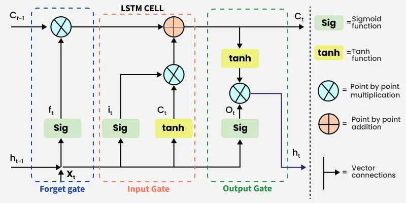
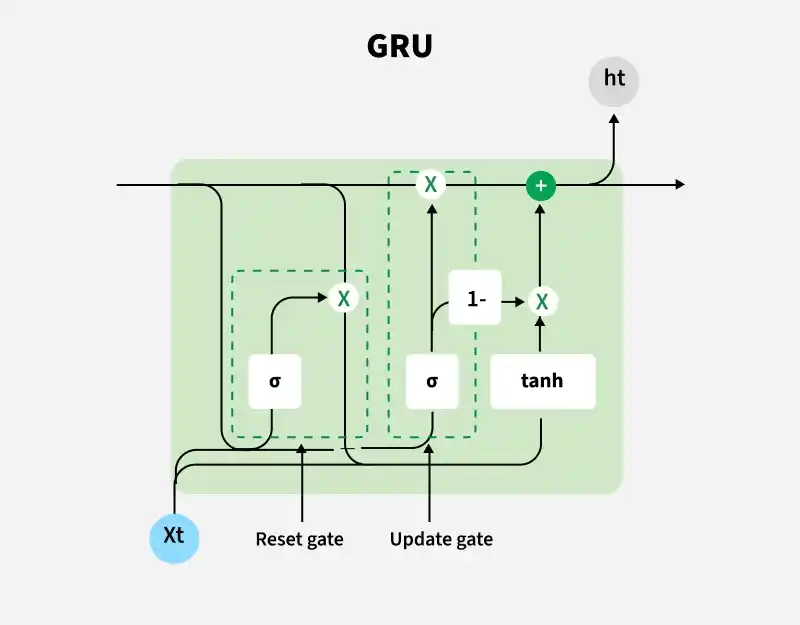

# Sequence Models


---

## 1. Definition and Fundamental Concepts

### What is a Sequence?
A **sequence** is data where **order matters**. If you shuffle the elements, the meaning changes or is destroyed.

Examples:
- Text: "I love ML" ≠ "ML love I"
- Stock prices over time
- Speech / audio waveforms
- DNA sequences
- Sensor readings over time (time series)

### What is a Sequence Model?
A **Sequence Model** is any model designed to take an ordered input (or produce an ordered output) and explicitly use the **positional/temporal relationship** between elements to make predictions.

Formally, given a sequence $x_1, x_2, ..., x_T$, a sequence model tries to learn:
$$P(y_t \mid x_1, x_2, ..., x_t)$$
i.e., predict something at time $t$ using information from the past (and sometimes future).

### Why can't we use a normal Feedforward Neural Network (FFN)?
Three core problems:

1. **Fixed input size**: FFNs need a fixed-size input vector. Sentences/time series have variable length.
2. **No memory / no notion of order**: FFN treats each input independently — it has no concept that "word 3 came after word 2." If you shuffle the input features, an FFN with the same weights would treat it identically (once flattened, order gets lost as "just another feature position").
3. **No parameter sharing across positions**: FFN would need separate weights for every position in every possible sequence length — this doesn't generalize and doesn't scale.

**Sequence models solve this by:**
- Sharing weights across time steps (same function applied at every step)
- Maintaining a "memory" (hidden state) that summarizes everything seen so far

### Types of Sequence Problems (by input/output shape)
| Type | Example |
|---|---|
| One-to-Many | Image captioning (1 image → sequence of words) |
| Many-to-One | Sentiment classification (sequence of words → 1 label) |
| Many-to-Many (aligned) | Named Entity Recognition (word → tag, same length) |
| Many-to-Many (unaligned) | Machine Translation (Encoder-Decoder, different lengths) |

---

## 2. Recurrent Neural Network (RNN)

### Why do we need RNN?
We need a network that can:
- Accept variable-length sequences
- Remember previous context using a **hidden state**
- Reuse the **same weights** at every time step (parameter sharing)

RNN does exactly this — it processes one element of the sequence at a time and carries forward a "memory" (hidden state) to the next step.

### Core Idea (in simple words)
Think of RNN like reading a sentence word by word while keeping a mental summary in your head. After each word, you update your mental summary. By the end, that summary tells you what the whole sentence was about.

### Architecture

At each time step $t$:

$$h_t = \tanh(W_{hh} \, h_{t-1} + W_{xh} \, x_t + b_h)$$
$$y_t = W_{hy} \, h_t + b_y$$

Where:
- $x_t$ = input at time step $t$
- $h_t$ = hidden state (the "memory") at time $t$
- $h_{t-1}$ = hidden state from the previous time step
- $W_{hh}, W_{xh}, W_{hy}$ = weight matrices (**same at every time step** — this is parameter sharing)
- $y_t$ = output at time $t$ (optional at every step, depending on task)

### Unrolling the RNN
An RNN is usually drawn as a single loop, but to understand training, we "unroll" it across time:

```
x1 → [RNN cell] → h1 → [RNN cell] → h2 → [RNN cell] → h3 → ...
        ↑                  ↑                  ↑
       h0                 x2                 x3
```

Each box is the **same** RNN cell (same weights), just applied at a different time step.

### Key Properties
- **Weight sharing**: same $W_{hh}, W_{xh}, W_{hy}$ used at every time step → far fewer parameters, and generalizes to any sequence length.
- **Hidden state = memory**: it's a fixed-size vector summarizing everything seen so far.
- **Sequential computation**: $h_t$ depends on $h_{t-1}$, so RNNs **cannot be parallelized across time** (unlike Transformers) — this makes training slow.

### The Big Problem with Vanilla RNN
Vanilla RNNs struggle to remember information from far back in the sequence. This is called the **long-term dependency problem**, caused by **vanishing/exploding gradients** (explained next in BPTT). This is the exact motivation for LSTM/GRU.

---

## 3. Backpropagation Through Time (BPTT)

### In Simple Words
Normal backpropagation adjusts weights by measuring "how much did this weight contribute to the error?" and moving it in the direction that reduces error.

BPTT does the same thing, but because RNN **reuses the same weights at every time step**, we must add up the "blame" for the weight from **every time step**, not just one.

Think of it like this: if you told a lie at step 1, and it caused problems at step 5, BPTT traces the error at step 5 all the way back to step 1 and updates weights accordingly — this trace runs backward through every unrolled time step, hence "**through time**."

### Mathematical Detail

Loss over the full sequence:
$$L = \sum_{t=1}^{T} L_t$$

We want $\frac{\partial L}{\partial W_{hh}}$. Since $W_{hh}$ is shared across all time steps:

$$\frac{\partial L}{\partial W_{hh}} = \sum_{t=1}^{T} \frac{\partial L_t}{\partial W_{hh}}$$

For a specific step $t$, the gradient must flow backward through **all previous hidden states**:

$$\frac{\partial L_t}{\partial W_{hh}} = \sum_{k=1}^{t} \frac{\partial L_t}{\partial h_t} \cdot \left( \prod_{i=k+1}^{t} \frac{\partial h_i}{\partial h_{i-1}} \right) \cdot \frac{\partial h_k}{\partial W_{hh}}$$

The key troublemaker is this chain of products:
$$\prod_{i=k+1}^{t} \frac{\partial h_i}{\partial h_{i-1}}$$

Since $h_i = \tanh(W_{hh}h_{i-1} + ...)$, each term in this product involves $W_{hh}$ and the derivative of $\tanh$ (which is always ≤ 1, and often much less than 1).

### Vanishing and Exploding Gradients (Why BPTT is hard)

- If the repeated multiplicative term is **< 1** → after many time steps, the product shrinks toward **zero** → **vanishing gradient** → the network **can't learn long-range dependencies** (forgets far-back context).
- If the repeated term is **> 1** → the product **explodes** → **exploding gradient** → unstable training, weights become NaN.

**Simple analogy**: Imagine whispering a message through a long line of 100 people (like the "telephone game"). By the time it reaches the last person, the message is either garbled beyond recognition (vanishing) or wildly exaggerated (exploding). Long sequences = many multiplications = high chance of vanishing/exploding.

### Practical fixes for exploding gradients
- **Gradient clipping**: cap the gradient norm to a maximum value.

### Practical fixes for vanishing gradients
- Use **LSTM / GRU** (different internal mechanism, explained next)
- Better weight initialization
- Use ReLU-family activations instead of tanh/sigmoid in some cases
- Truncated BPTT: only backpropagate through a limited number of steps (a compute-time trick, not a full fix)

### Truncated BPTT (important interview point)
For very long sequences, doing full BPTT is computationally expensive. **Truncated BPTT** splits the sequence into chunks and only backpropagates within each chunk (though the hidden state is still carried forward). This trades off some accuracy of long-term gradient signal for computational feasibility.

---

## 4. LSTM (Long Short-Term Memory)

### Why do we need LSTM?
Vanilla RNN's hidden state $h_t$ is **overwritten** at every time step through a single tanh transformation — it has no way to protect important information from being erased, and gradients vanish over long sequences.

**LSTM's key innovation**: introduce a separate "conveyor belt" called the **cell state** $C_t$, plus **gates** that carefully **control** what to add, remove, or output — instead of blindly overwriting the memory.

### Simple Analogy
Think of the cell state as a **conveyor belt** running through the whole factory (sequence). At each station (time step), workers (gates) decide:
- What old stuff on the belt should be **thrown away** (forget gate)
- What new stuff should be **added** to the belt (input gate)
- What part of the belt's content should be **shown to the outside world** right now (output gate)

Because the belt has very few transformations directly applied to it (mostly just addition), information can flow across many time steps largely **unchanged** — solving the vanishing gradient problem.

### LSTM Architecture

At each time step $t$, LSTM has two states passed forward: the **cell state** $C_t$ and the **hidden state** $h_t$.

Inputs at each step: $x_t$ (current input), $h_{t-1}$ (previous hidden state), $C_{t-1}$ (previous cell state).

<p align="center">
    <br>
    <em>Figure 1: LSTM</em>
</p>

#### Step 1: Forget Gate $f_t$
Decides **what to remove** from the cell state.
$$f_t = \sigma(W_f \cdot [h_{t-1}, x_t] + b_f)$$
- Output is between 0 and 1 (sigmoid), for **each number in the cell state**.
- 0 = "completely forget this," 1 = "completely keep this."

*Example*: In "Sourav lives in Bengaluru. He works at Citi. ___ is a Senior Data Scientist" — once a new subject appears, the forget gate can help drop old subject information that's no longer relevant to track.

#### Step 2: Input Gate $i_t$ + Candidate Values $\tilde{C}_t$
Decides **what new information to store**.
$$i_t = \sigma(W_i \cdot [h_{t-1}, x_t] + b_i)$$
$$\tilde{C}_t = \tanh(W_C \cdot [h_{t-1}, x_t] + b_C)$$
- $i_t$ (sigmoid, 0–1): how much of the new candidate to let in.
- $\tilde{C}_t$ (tanh, -1 to 1): the actual new candidate values to potentially add.

#### Step 3: Update Cell State
Combine forget + input decisions:
$$C_t = f_t * C_{t-1} + i_t * \tilde{C}_t$$
- This is the **key equation**: notice it's mostly **addition and elementwise multiplication**, not repeated matrix multiplication through a squashing function like in vanilla RNN. This is *why* gradients survive much longer — the gradient path through $C_t$ is close to additive/linear (an "gradient highway").

#### Step 4: Output Gate $o_t$ + Hidden State
Decides **what part of the cell state to expose** as the output/hidden state.
$$o_t = \sigma(W_o \cdot [h_{t-1}, x_t] + b_o)$$
$$h_t = o_t * \tanh(C_t)$$

### Summary Table of Gates
| Gate | Formula | Role | Activation |
|---|---|---|---|
| Forget Gate | $f_t = \sigma(W_f[h_{t-1},x_t]+b_f)$ | What to erase from memory | Sigmoid |
| Input Gate | $i_t = \sigma(W_i[h_{t-1},x_t]+b_i)$ | How much new info to add | Sigmoid |
| Candidate | $\tilde{C}_t = \tanh(W_C[h_{t-1},x_t]+b_C)$ | New candidate content | Tanh |
| Cell State Update | $C_t = f_t C_{t-1} + i_t \tilde{C}_t$ | Actual long-term memory | — |
| Output Gate | $o_t = \sigma(W_o[h_{t-1},x_t]+b_o)$ | What to reveal now | Sigmoid |
| Hidden State | $h_t = o_t \tanh(C_t)$ | Short-term output/memory | Tanh |

### Why sigmoid for gates and tanh for candidates?
- **Sigmoid (0 to 1)** acts as a natural "gate"/switch — 0 means fully closed, 1 means fully open.
- **Tanh (-1 to 1)** is used for the actual content because it's zero-centered, which helps with stable gradients and lets values both increase and decrease the cell state.

---

## 5. GRU (Gated Recurrent Unit)

### Why do we need GRU?
LSTM works great but has **3 gates and 2 states** (cell state + hidden state) → more parameters → slower to train, more compute.

**GRU simplifies LSTM**: fewer gates, only **one state** (no separate cell state), often achieves comparable performance with **fewer parameters** and faster training — good for smaller datasets or when compute/speed matters.

### GRU Architecture

GRU has only **2 gates**: Reset gate and Update gate, and **one hidden state** $h_t$ (no separate cell state).

<p align="center">
    <br>
    <em>Figure 2: GRU</em>
</p>

#### Update Gate $z_t$
Decides how much of the past to keep vs. how much new info to add (combines the role of LSTM's forget + input gates into one).
$$z_t = \sigma(W_z \cdot [h_{t-1}, x_t] + b_z)$$

#### Reset Gate $r_t$
Decides how much past information to "forget" when computing the new candidate.
$$r_t = \sigma(W_r \cdot [h_{t-1}, x_t] + b_r)$$

#### Candidate Hidden State
$$\tilde{h}_t = \tanh(W \cdot [r_t * h_{t-1}, x_t] + b)$$

#### Final Hidden State Update
$$h_t = (1 - z_t) * h_{t-1} + z_t * \tilde{h}_t$$

Notice: $z_t$ acts like a **blend knob** — it interpolates between old hidden state and new candidate, in one single equation (unlike LSTM's separate forget + input steps).

### GRU vs LSTM — Quick Comparison Table
| Aspect | LSTM | GRU |
|---|---|---|
| Gates | 3 (forget, input, output) | 2 (update, reset) |
| States | Cell state + Hidden state (2) | Only Hidden state (1) |
| Parameters | More | ~25–33% fewer |
| Training speed | Slower | Faster |
| Performance | Slightly better on very long/complex sequences (empirically, task-dependent) | Comparable, often just as good |
| When to prefer | Large datasets, long-range dependency critical | Smaller datasets, need for speed, limited compute |

**Interview tip**: There's no universally "better" one — it's an empirical, task-dependent choice. Always mention you'd try both and validate.

---

## 6. Other Important Sequence Modelling Topics

### 6.1 Bidirectional RNN/LSTM (BiLSTM)
Runs two RNNs — one forward (left→right) and one backward (right→left) — and concatenates their hidden states. Useful when the **full context (past AND future)** is available at prediction time (e.g., NER, POS tagging). **Not usable for real-time/causal prediction** (like language generation) since it needs the future.

### 6.2 Encoder-Decoder (Seq2Seq) Architecture
Used when input and output sequences have **different lengths** (e.g., translation: English sentence → French sentence).
- **Encoder**: reads the whole input sequence, compresses it into a fixed-size **context vector** (final hidden state).
- **Decoder**: takes that context vector and generates the output sequence step by step.
- **Bottleneck problem**: a single fixed-size vector struggles to capture very long input sequences → motivated the invention of **Attention**.

### 6.3 Attention Mechanism
Instead of forcing the decoder to rely on just one fixed context vector, **attention** lets the decoder "look back" at **all** encoder hidden states at every decoding step, and learn to assign different importance (weights) to different input positions.
$$\text{context}_t = \sum_i \alpha_{t,i} \, h_i$$
where $\alpha_{t,i}$ are attention weights (softmax over alignment scores). This solved the long-sequence bottleneck and is the direct precursor to **Transformers** (which use "self-attention" and completely remove recurrence).

### 6.4 Teacher Forcing
During training a Seq2Seq model, instead of feeding the decoder's own (possibly wrong) previous prediction back in, we feed the **actual ground-truth** previous token. This speeds up and stabilizes training but can cause a **train-test mismatch** (exposure bias) since at test time the model only has its own predictions to feed back in.

### 6.5 Padding, Masking, and Packing
Since sequences in a batch have different lengths, we **pad** shorter ones with a special token to make a rectangular batch tensor. We then use a **mask** so the model/loss ignores the padded positions. Frameworks like PyTorch provide `pack_padded_sequence` to make RNN computation efficient by skipping padded steps.

### 6.6 Why Transformers eventually replaced RNN/LSTM/GRU for most NLP tasks
- RNNs process sequentially → can't parallelize across time → slow on GPUs.
- Transformers use **self-attention** → process the whole sequence in parallel, and directly connect any two positions (no matter how far apart) in a single step, avoiding vanishing gradient over long distances.
- RNN family is still useful for streaming/online settings, low-resource devices, and pure time-series problems where sequence lengths are short-to-moderate.

### 6.7 Common Applications
- Language modelling / text generation
- Machine translation
- Speech recognition
- Time series forecasting (stock prices, demand forecasting — relevant to SARIMAX-style work too)
- Sentiment analysis, NER
- Video/action recognition (sequences of frames)

---

## 7. Simple Illustrative Code Example (PyTorch)

A minimal example: predicting the next value in a toy numeric sequence using LSTM.

```python
import torch
import torch.nn as nn
import numpy as np

# ---- 1. Create toy sequence data ----
# Example: a simple sine wave sequence
seq_len = 10
data = np.sin(np.linspace(0, 50, 500))

def create_sequences(data, seq_len):
    X, y = [], []
    for i in range(len(data) - seq_len):
        X.append(data[i:i+seq_len])
        y.append(data[i+seq_len])
    return np.array(X), np.array(y)

X, y = create_sequences(data, seq_len)
X = torch.tensor(X, dtype=torch.float32).unsqueeze(-1)  # shape: (batch, seq_len, input_size=1)
y = torch.tensor(y, dtype=torch.float32).unsqueeze(-1)  # shape: (batch, 1)

# ---- 2. Define an LSTM-based model ----
class SequencePredictor(nn.Module):
    def __init__(self, input_size=1, hidden_size=32, num_layers=1):
        super().__init__()
        self.lstm = nn.LSTM(input_size, hidden_size, num_layers, batch_first=True)
        self.fc = nn.Linear(hidden_size, 1)

    def forward(self, x):
        # x shape: (batch, seq_len, input_size)
        out, (h_n, c_n) = self.lstm(x)
        # We only need the last time step's output for prediction
        last_hidden = out[:, -1, :]        # shape: (batch, hidden_size)
        return self.fc(last_hidden)        # shape: (batch, 1)

model = SequencePredictor()

# ---- 3. Train ----
criterion = nn.MSELoss()
optimizer = torch.optim.Adam(model.parameters(), lr=0.01)

for epoch in range(100):
    optimizer.zero_grad()
    preds = model(X)
    loss = criterion(preds, y)
    loss.backward()
    optimizer.step()
    if (epoch + 1) % 20 == 0:
        print(f"Epoch {epoch+1}, Loss: {loss.item():.4f}")

# ---- 4. Predict next value after the last known sequence ----
last_seq = torch.tensor(data[-seq_len:], dtype=torch.float32).view(1, seq_len, 1)
next_val = model(last_seq)
print("Predicted next value:", next_val.item())
```

**What to notice in this code (good to mention in interviews):**
- Input shape is `(batch, seq_len, input_size)` — this 3D shape is standard for RNN/LSTM/GRU in PyTorch.
- `out` contains the hidden state at **every** time step; `h_n` is just the **last** hidden state (same as `out[:, -1, :]` for a single-layer, single-direction LSTM).
- We use only the last time step's output here because this is a **many-to-one** task (predict a single next value).
- Swapping `nn.LSTM` for `nn.GRU` or `nn.RNN` requires almost no other code change — showing how these architectures share the same basic interface.

---

## 8. Interview Questions & Expert Answers

### Q1. Why can't we just use a feedforward network for sequence data?
**A:** FFNs require fixed-size inputs and treat every input independently with no shared memory across positions — they can't naturally model variable-length sequences or capture temporal/order dependencies. RNNs solve this by sharing weights across time steps and maintaining a hidden state that acts as memory.

### Q2. What is the vanishing gradient problem and why does it happen in RNNs specifically?
**A:** During BPTT, gradients are computed by multiplying many Jacobian terms (one per time step) together, each of which is generally less than 1 in magnitude (especially with tanh/sigmoid, whose derivatives are bounded by ≤0.25–1). Multiplying many such small numbers together across long sequences causes the gradient to shrink exponentially toward zero, so weights corresponding to long-range dependencies barely get updated — the model "forgets" distant context.

### Q3. How does LSTM solve the vanishing gradient problem, exactly?
**A:** LSTM introduces the cell state $C_t$, updated via $C_t = f_t C_{t-1} + i_t \tilde{C}_t$ — a mostly **additive** update path rather than repeated multiplication through a squashing nonlinearity. This creates something like a "gradient highway": if the forget gate is close to 1, gradients can flow backward through many time steps nearly unchanged, since the local derivative of this update w.r.t. $C_{t-1}$ is close to $f_t$ (not repeatedly shrunk by a chain of tanh derivatives and weight matrices).

### Q4. What's the difference between the cell state and the hidden state in LSTM?
**A:** The **cell state** $C_t$ is the long-term memory, updated mostly through addition/gating and carried across time with minimal transformation. The **hidden state** $h_t$ is the short-term, filtered "view" of the cell state exposed at the current time step (through the output gate and a tanh), used both as the output and as input to the next time step's gates.

### Q5. Why do we need three separate gates in LSTM — couldn't fewer work?
**A:** Each gate serves a distinct purpose: forget (what to discard from long-term memory), input (what new info to add), output (what part of memory to expose right now). GRU actually shows you *can* simplify this — it merges the forget/input roles into one "update gate" and drops the separate cell state, achieving similar results with fewer parameters. So the 3-gate design isn't strictly necessary, but it gives more fine-grained control, which can help on harder/longer tasks.

### Q6. When would you choose GRU over LSTM, and vice versa?
**A:** GRU: fewer parameters, faster training/inference, works well on smaller datasets or where compute is limited, and is a good default first try. LSTM: an extra gate and separate cell state can give it a slight edge on tasks needing very fine control over memory, or very long sequences. In practice, this is empirical — try both and validate on your specific dataset; there's no universal winner.

### Q7. What is BPTT, and why is it computationally expensive?
**A:** BPTT unrolls the RNN across all time steps and backpropagates the error gradient through this unrolled graph, accumulating gradients for shared weights across every time step. It's expensive because you must store all intermediate hidden states for the whole sequence (memory cost grows with sequence length) and the backward pass involves as many steps as the forward pass. For very long sequences, **truncated BPTT** is used to bound this cost.

### Q8. What is exposure bias / teacher forcing, and why is it a problem?
**A:** During training, teacher forcing feeds the ground-truth previous token into the decoder instead of the model's own prediction, which speeds up and stabilizes learning. But at inference time, there's no ground truth — the model must feed its own (possibly erroneous) predictions back in. This mismatch between training and inference conditions is called **exposure bias**, and small errors can compound over the generated sequence. Fixes include scheduled sampling (gradually reducing teacher forcing during training).

### Q9. Why can't standard RNN/LSTM be parallelized across time, and why does this matter?
**A:** Computing $h_t$ requires $h_{t-1}$, so each time step must wait for the previous one to finish — this sequential dependency prevents parallelizing the computation across the time dimension, unlike Transformers which use self-attention over the whole sequence at once. This makes RNN-family models slower to train on modern GPU/TPU hardware, which is a major reason Transformers became dominant for large-scale NLP.

### Q10. What is the difference between a many-to-one and many-to-many sequence model, with examples?
**A:** Many-to-one takes a full sequence and produces a single output (e.g., sentiment classification: a sentence → positive/negative). Many-to-many produces an output at every time step (aligned, e.g., NER: word → tag) or a full sequence output of different length (unaligned, e.g., translation, requiring an encoder-decoder architecture).

### Q11. Why is tanh (not ReLU) traditionally used inside RNN/LSTM cells?
**A:** Tanh is zero-centered and bounded in (-1, 1), which helps keep the hidden/cell state values in a stable, bounded range over many time steps — important since these values get repeatedly reused. ReLU is unbounded, so repeatedly adding/multiplying unbounded activations across many time steps risks exploding values. (Note: some modern RNN variants do experiment with ReLU with careful initialization, but tanh/sigmoid remain the standard default for gates and candidate states.)

### Q12. What is gradient clipping and when is it used?
**A:** Gradient clipping caps the norm (or value) of gradients before the weight update, preventing exploding gradients from causing unstable, huge parameter updates. It's typically applied by rescaling the gradient vector if its norm exceeds a threshold: $g \leftarrow g \cdot \frac{\text{threshold}}{\|g\|}$ if $\|g\| > \text{threshold}$. It addresses exploding gradients but does **not** solve vanishing gradients.

### Q13. In an LSTM, if the forget gate output is close to 0 for all time steps, what happens?
**A:** The cell state gets reset/erased almost entirely at every step ($C_t \approx i_t \tilde{C}_t$, ignoring the past), meaning the LSTM behaves almost like it has no long-term memory — similar to a network that can only use very recent, short-term context. This shows the forget gate is the primary mechanism controlling how "long" the long-term memory actually persists.

### Q14. How would you handle variable-length sequences in a batch during training?
**A:** Pad all sequences in a batch to the same length (with a padding token/value), then apply a mask so loss and attention/gating computations ignore the padded positions. Frameworks provide utilities like `pack_padded_sequence`/`pad_packed_sequence` in PyTorch to make the RNN skip computation on padding efficiently rather than wasting compute on it.

### Q15. Bonus/tricky: Why does using a Bidirectional LSTM not work for real-time language generation, even though it often performs better on tasks like NER?
**A:** BiLSTM requires processing the **entire** sequence in both directions, meaning it needs future tokens to compute the backward pass at any position — this is impossible in real-time/causal generation tasks (like next-word prediction while typing), where future tokens don't exist yet. It works great for NER/tagging because at inference time for those tasks, the **full sentence is already available upfront**.

---

## Quick Summary Cheat-Sheet

| Concept | One-line takeaway |
|---|---|
| RNN | Shares weights across time, keeps a hidden state as memory; struggles with long-range dependencies |
| BPTT | Backprop unrolled across time; gradients accumulate via chain rule across all steps |
| Vanishing/Exploding Gradient | Repeated multiplication of small/large derivatives across time steps |
| LSTM | Adds a cell state + 3 gates (forget, input, output) to control memory flow, mostly additively |
| GRU | Simplified LSTM: 2 gates (update, reset), 1 state, fewer parameters, comparable performance |
| Bidirectional RNN | Two RNNs (forward+backward); needs full sequence upfront |
| Seq2Seq | Encoder compresses input → Decoder generates output; used for differing input/output lengths |
| Attention | Lets decoder look at all encoder states, weighted by relevance — fixes the fixed-context bottleneck |
| Transformers | Removed recurrence entirely using self-attention → parallelizable, dominant in modern NLP |

---